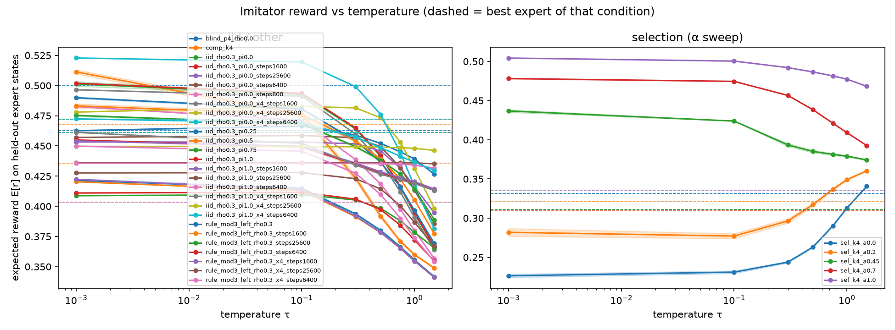
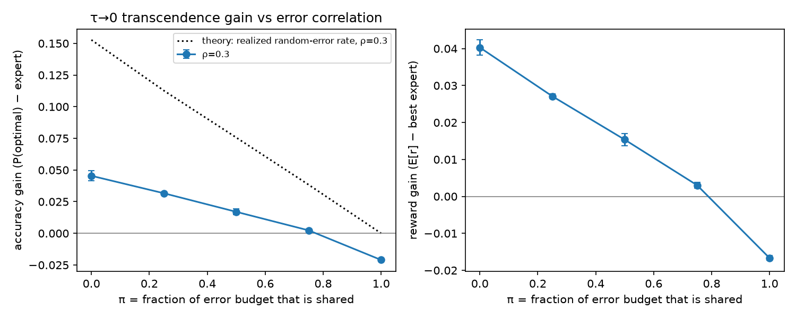
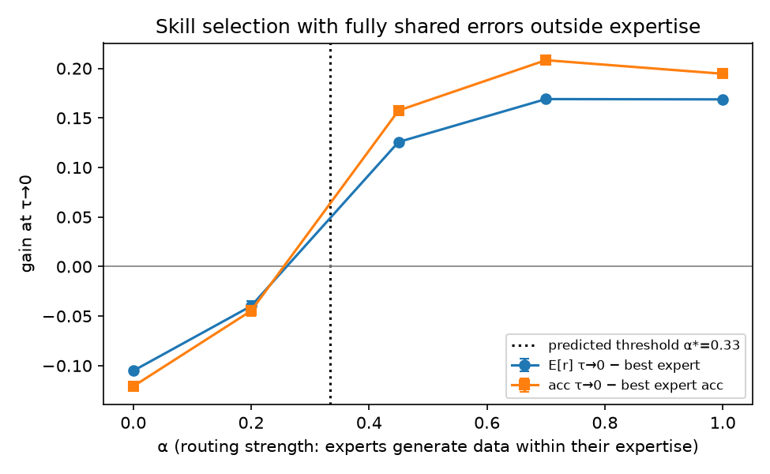
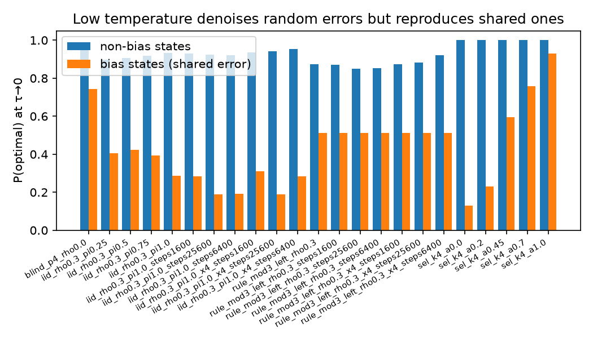
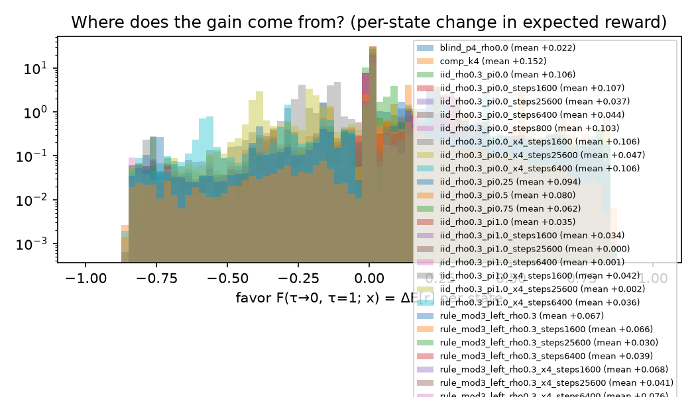
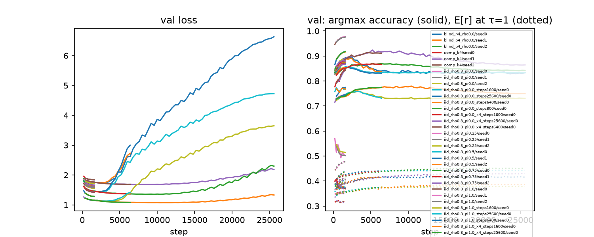

# Resultados de la noche (2 sep 2026)

Corrido en la Mac M4 (MPS), sin GPU externa. Todo local, reproducible con `scripts/overnight_gen.sh` y `scripts/overnight_train.sh`.

**Qué se corrió.** 13 condiciones, 80k partidas de entrenamiento cada una (≈1.6M estados) y 3k partidas de test de los mismos
expertos con otra semilla (≈60k estados). Imitador de 6.3M parámetros (8 capas, 256 d), juego "a ciegas" sobre la secuencia
de jugadas, 1600 pasos × batch 512 (≈10 epochs). Recompensa exacta del solver de Pons en cada estado y jugada. Evaluación
desde logits, sin muestreo, en τ ∈ {0.001 … 1.5}, más 150 partidas contra el bot experto por temperatura. Tres semillas por
condición (las dos adicionales entrenadas en una RTX 4090 de RunPod, 2 sep por la tarde), más un estudio de escala de una semilla.

## Hallazgos

**1. El denoising funciona y escala con la diversidad de errores (H1, H3).** A tasa de error fija, la ganancia a τ→0 sobre el
experto cae monótonamente con la fracción compartida π: en E[r], +0.040 (π=0), +0.027 (0.25), +0.017 (0.5), +0.004 (0.75),
−0.017 (1.0). El signo cambia donde la teoría lo predice y la caída es casi lineal en π, como predice la fórmula ρ(1−π) salvo por el factor de escala. Las magnitudes son ~¼ del techo teórico porque el imitador nunca
llega al argmax de la mezcla en estados no vistos: su accuracy a τ=1 está *por debajo* del experto en todas las condiciones,
o sea que la distribución aprendida es una copia más plana de los datos. Bajar τ saca el ruido de los expertos y también la
entropía residual del modelo.

**2. Un error compartido aprendible se reproduce exacto y no se puede denoisear (H2).** En la condición `rule` (todos los
expertos juegan la columna legal más a la izquierda en las jugadas múltiplo de 3) la accuracy del modelo en esas jugadas
coincide con la del experto a tres decimales en cada fase del juego, y en cada checkpoint desde el paso 200. El modelo aprende
la regla de inmediato y la mantiene. Lo mismo en el control de ceguera de apertura: P(centro | tablero vacío) = 0.0001 a τ=1
y 0 a τ→0. **No hay discovery**, como predicen el Teorema 2 y la taxonomía.

**3. Un error compartido pero no aprendible sí se denoisea en estados no vistos.** Es el hallazgo que no estaba en la
teoría. En π=1 el sesgo se define por un hash de la posición, imposible de representar. En apertura (estados vistos) la
accuracy en estados sesgados a τ→0 es 0.007: Teorema 2 exacto. En mediojuego y final (estados nuevos) sube a 0.41 y 0.56:
el modelo generaliza el comportamiento mayoritario, que es el óptimo. Por eso el modelo π=1 le gana al experto cabeza a
cabeza (0.61) aunque no transciende en la distribución de estados del experto. La noción relevante de "compartido" para un
imitador finito es *compartido entre expertos y representable como función del estado*.

**4. Skill selection tiene umbral donde se predijo.** Con errores totalmente compartidos fuera de la expertise y fuerza de
ruteo α, la ganancia a τ→0 sobre el mejor experto es −0.104 (α=0), −0.043 (0.2), +0.126 (0.45), +0.170 (0.7), +0.169 (1.0).
El cambio de signo está entre 0.2 y 0.45, consistente con α* = 1/3. Debajo del umbral bajar la temperatura **empeora**: el
modelo se compromete con el error compartido. La transición no es escalón sino suave: la accuracy en estados con jugada
equivocada disponible es 0.22, 0.60, 0.76, 0.93 para α = 0.2, 0.45, 0.7, 1.0, siguiendo el margen de la mezcla. Un dato
lateral: a τ=1 la mezcla ruteada ya supera al mejor experto para todo α>0. Selection no necesita temperatura baja;
denoising sí.

**5. Expertos complementarios (Teorema 4).** Cuatro expertos óptimos en su región y aleatorios afuera: +0.077 sobre el
mejor experto a τ→0. Mismo régimen que π=0, ganancia mayor porque los expertos individuales son mucho peores mientras el
argmax de la mezcla sigue siendo óptimo en todo el espacio.

## Actualización de la tarde (RunPod): semillas y estudio de escala

**Semillas.** Los desvíos entre 3 semillas son de 0.001 a 0.005 en E[r], muy por debajo de las diferencias entre condiciones.
Todo lo de arriba se sostiene, incluida la posición del umbral de selection (sí/sí/sí en α ≥ 0.45, no/no/no en α ≤ 0.2).

**Escala (π=0, una semilla).** 80k vs 320k partidas × 1600 / 6400 / 25600 pasos:

| Datos | Pasos | Epochs | acc τ=1 | acc τ→0 | val loss final (mínima) |
|---|---|---|---|---|---|
| 80k | 1600 | 10 | 0.763 | 0.891 | 1.76 (1.76) |
| 80k | 6400 | 42 | 0.786 | 0.837 | 2.73 (1.74 @2400) |
| 80k | 25600 | 167 | 0.790 | 0.835 | 6.63 (1.74 @2400) |
| 320k | 1600 | 2.6 | 0.758 | 0.888 | 1.76 (1.76) |
| 320k | 6400 | 10 | 0.789 | **0.914** | 1.69 (1.69 @6000) |
| 320k | 25600 | 42 | 0.807 | 0.865 | 2.18 (1.69 @8400) |

- Más entrenamiento sobre los mismos datos destruye la transcendencia: el modelo memoriza las partidas concretas, con sus
  errores aleatorios, y el argmax deja de ser el voto de la mayoría. Es la dinámica de memorización de etiquetas ruidosas de
  Arpit et al. 2017; el paper de ajedrez (una pasada sobre 10⁹ partidas) nunca entra en ese régimen. En π=1 el mismo
  sobreajuste tiene el síntoma opuesto: el modelo aprende trozos del sesgo por hash y deja de generalizarlo (acc en estados
  sesgados del final 0.67 → 0.50). En la regla, el sobreajuste no cambia nada en las jugadas de regla (0.248/0.632/0.728
  en todas las celdas) y solo degrada el resto. Una causa, tres síntomas.
- Más datos aumentan la ganancia: 320k y 10 epochs da la mejor celda, +0.062 sobre el experto (0.915 en el checkpoint de
  mejor val loss). El techo teórico (1.0) sigue lejos.
- La accuracy a τ=1 sube con datos (0.763 → 0.789 → 0.807) pero no alcanza al experto (0.845). Tendencia de límite de
  datos, no evidencia de un efecto estructural.
- Limitación del pipeline: evalúa el checkpoint final, no el de mejor val loss. Para cualquier uso serio de la fase B hay
  que cambiar eso.

## Veredicto (2 sep, noche)

Las dos teorías se cumplen en signo en todas las celdas. Los desvíos son de magnitud (el imitador captura ~¼ del techo) y de
régimen (sobreajuste, representabilidad, entropía residual), y cada uno es lo que un practicante habría predicho. No hay
paper acá más allá de una nota de workshop; el activo es el testbed. La única extensión con resultado genuinamente incierto
que encontramos en la literatura es la composición de habilidades entre demostradores con soporte disjunto (la brecha que
Zhang et al. nombran explícitamente): expertos A óptimos hasta la jugada N con partidas truncadas, expertos B con apertura
de calidad q y final óptimo, medir la calidad del final del imitador en sus propias trayectorias en función de q.

## Lo que esto dice de los dos papers

- El mecanismo de Zhang et al. se reproduce en un dominio secuencial con recompensa exacta, y la condición de diversidad que
  ellos solo correlacionaron con entropía acá se manipula y da la curva monótona esperada.
- El umbral de selection es una predicción cuantitativa que la taxonomía no tiene y que se cumple en signo. La suavidad de
  la transición es lo que agrega un modelo finito a la teoría.
- El hallazgo 3 es una forma de transcendencia que ninguno de los dos marcos captura: no es voto por estado (Teorema 2 dice
  que el argmax es el error) sino generalización entre estados. Es barata de verificar y separa dos cosas que los papers
  juntan bajo "errores correlacionados": correlación entre expertos y estructura en el espacio de estados.

## Cautelas

- Una semilla por celda en la mayoría de las condiciones. Efectos de ±0.02 en E[r] están en el borde de lo que una semilla
  sostiene; el patrón de signos entre condiciones es lo robusto. Las segundas semillas se están agregando.
- El modelo está subentrenado respecto del supuesto teórico (τ=1 por debajo de la mezcla). Con más datos o pasos la ganancia
  de π=0 debería acercarse al techo; medir cuánto es en sí informativo.
- ρ se aplica solo a los estados donde existe una jugada peor (~52 %), así que las tasas de error realizadas (~0.15) son la
  mitad de las nominales. Las predicciones usan las tasas realizadas.
- En el partido cabeza a cabeza el modelo pierde algunas partidas por jugada ilegal tras 5 reintentos (0 a 15 de 150 según
  la condición), igual que en el protocolo del paper.

Las tablas completas, generadas automáticamente, siguen abajo. Log cronológico con decisiones en `overnight/notes.md`.

---

# Results

All numbers are on held-out states generated by the same experts (fresh seed).
`acc` = probability mass the imitator puts on an optimal move (exact, from logits). `E[r]` = expected reward (win 1, draw 0.5, loss 0, illegal 0).
`best expert` = the best single expert's expected reward on the same states. **Transcendence** = imitator E[r] > best expert.
Match score = (wins + 0.5 draws)/games of the imitator against an expert bot, alternating colours, 5 retries on illegal output.

## H1–H3, H5: error correlation π at fixed error rate ρ (denoising)

Prediction: acc(τ→0) ≈ 1 − shared-error rate; gain over the expert ≈ realized random-error rate; on bias states acc(τ→0) ≈ 0.

| π | seeds | expert acc | acc τ=1 | acc τ→0 | **theory acc τ→0** | E[r] τ→0 − best expert | acc τ→0 bias states | bias states by phase (open/mid/late) | acc τ→0 non-bias | match τ→0 | match τ=1 |
|---|---|---|---|---|---|---|---|---|---|---|---|
| 0.0 | 3 | 84.5 ± 0.0 | 76.2 ± 0.2 | 89.1 ± 0.4 | 100.0 ± 0.0 | 4.0 ± 0.2 | – | –/–/– | 89.1 ± 0.4 | 71.3 ± 1.2 | 25.8 ± 5.1 |
| 0.25 | 3 | 84.6 ± 0.0 | 76.4 ± 0.0 | 87.8 ± 0.1 | 96.2 ± 0.0 | 2.7 ± 0.1 | 40.5 ± 0.6 | 13.1 ± 0.6/63.2 ± 0.8/62.5 ± 1.9 | 89.7 ± 0.1 | 67.6 ± 1.8 | 26.2 ± 2.0 |
| 0.5 | 3 | 85.7 ± 0.0 | 77.9 ± 0.0 | 87.4 ± 0.2 | 93.5 ± 0.0 | 1.5 ± 0.2 | 42.4 ± 0.6 | 11.5 ± 0.6/62.3 ± 0.7/59.0 ± 1.7 | 90.5 ± 0.2 | 69.3 ± 2.2 | 28.4 ± 4.6 |
| 0.75 | 3 | 86.6 ± 0.0 | 79.4 ± 0.0 | 86.8 ± 0.1 | 90.5 ± 0.0 | 0.3 ± 0.1 | 39.2 ± 0.2 | 7.5 ± 0.6/53.6 ± 0.7/59.3 ± 0.4 | 91.8 ± 0.1 | 58.7 ± 2.7 | 28.6 ± 2.3 |
| 1.0 | 3 | 86.7 ± 0.0 | 80.6 ± 0.1 | 84.6 ± 0.0 | 86.7 ± 0.0 | -1.7 ± 0.1 | 28.6 ± 0.1 | 0.6 ± 0.0/41.2 ± 0.4/56.1 ± 0.9 | 93.2 ± 0.0 | 61.4 ± 0.4 | 29.1 ± 1.8 |

## Skill selection: routing strength α with fully shared errors outside expertise

Prediction: τ→0 transcends the best expert iff α > α* = 0.333. Mixture mass on optimal = α + (1−α)/K.

| α | predicted | seeds | best expert acc | mixture acc | acc τ=1 | acc τ→0 | E[r] τ→0 − best expert | transcends? | match τ→0 | match τ=1 |
|---|---|---|---|---|---|---|---|---|---|---|
| 0.0 | no | 3 | 48.5 ± 0.0 | 45.2 ± 0.0 | 47.3 ± 0.1 | 36.4 ± 0.2 | -10.5 ± 0.2 | no/no/no | 26.6 ± 5.0 | 51.7 ± 3.9 |
| 0.2 | no | 3 | 54.9 ± 0.0 | 61.4 ± 0.0 | 59.8 ± 0.1 | 50.5 ± 0.6 | -4.0 ± 0.5 | no/no/no | 54.9 ± 2.6 | 58.0 ± 1.4 |
| 0.45 | yes | 3 | 62.0 ± 0.0 | 77.3 ± 0.0 | 71.4 ± 0.1 | 77.8 ± 0.2 | 12.6 ± 0.2 | yes/yes/yes | 84.7 ± 3.0 | 61.1 ± 1.7 |
| 0.7 | yes | 3 | 67.5 ± 0.0 | 89.2 ± 0.0 | 80.4 ± 0.0 | 88.3 ± 0.1 | 16.9 ± 0.1 | yes/yes/yes | 88.2 ± 2.3 | 67.7 ± 2.4 |
| 1.0 | yes | 3 | 78.1 ± 0.0 | 100.0 ± 0.0 | 94.5 ± 0.0 | 97.5 ± 0.0 | 16.9 ± 0.0 | yes/yes/yes | 73.2 ± 11.0 | 63.2 ± 2.0 |

## Other conditions

| condition | seeds | best expert acc | mixture acc | acc τ=1 | acc τ→0 | E[r] τ→0 − best expert | acc τ→0 bias states (expert acc on same states) | bias by phase (open/mid/late) | match τ→0 |
|---|---|---|---|---|---|---|---|---|---|
| blind_p4_rho0.0 | 3 | 96.3 ± 0.0 | 96.3 ± 0.0 | 87.4 ± 0.0 | 91.8 ± 0.1 | -3.7 ± 0.1 | 74.4 ± 0.0 (74.4 ± 0.0) | 74.4 ± 0.0/–/– | 27.5 ± 0.9 |
| comp_k4 | 3 | 75.7 ± 0.0 | 72.5 ± 0.0 | 66.7 ± 0.1 | 84.9 ± 0.2 | 7.6 ± 0.2 | – (–) | –/–/– | 75.2 ± 2.1 |
| iid_rho0.3_pi0.0_steps1600 | 1 | 84.5 | 84.5 | 76.3 | 89.1 | 4.1 | – (–) | –/–/– | 69.0 |
| iid_rho0.3_pi0.0_steps25600 | 1 | 84.5 | 84.5 | 79.0 | 83.5 | -0.8 | – (–) | –/–/– | 37.0 |
| iid_rho0.3_pi0.0_steps6400 | 1 | 84.5 | 84.5 | 78.6 | 83.7 | -0.4 | – (–) | –/–/– | 38.5 |
| iid_rho0.3_pi0.0_steps800 | 1 | 84.5 | 84.5 | 74.5 | 86.9 | 2.1 | – (–) | –/–/– | 66.7 |
| iid_rho0.3_pi0.0_x4_steps1600 | 1 | 84.5 | 84.5 | 75.8 | 88.8 | 3.5 | – (–) | –/–/– | 69.0 |
| iid_rho0.3_pi0.0_x4_steps25600 | 1 | 84.5 | 84.5 | 80.7 | 86.5 | 1.7 | – (–) | –/–/– | 51.7 |
| iid_rho0.3_pi0.0_x4_steps6400 | 1 | 84.5 | 84.5 | 78.9 | 91.4 | 6.2 | – (–) | –/–/– | 80.2 |
| iid_rho0.3_pi1.0_steps1600 | 1 | 86.7 | 86.7 | 80.7 | 84.4 | -1.7 | 28.4 (0.0) | 0.6/41.2/55.4 | 48.5 |
| iid_rho0.3_pi1.0_steps25600 | 1 | 86.7 | 86.7 | 82.5 | 82.5 | -3.5 | 18.9 (0.0) | 0.0/25.6/43.4 | 48.5 |
| iid_rho0.3_pi1.0_steps6400 | 1 | 86.7 | 86.7 | 82.3 | 82.5 | -3.6 | 19.3 (0.0) | 0.0/26.0/44.9 | 38.5 |
| iid_rho0.3_pi1.0_x4_steps1600 | 1 | 86.7 | 86.7 | 80.5 | 85.3 | -1.0 | 31.2 (0.0) | 1.5/44.8/60.0 | 48.5 |
| iid_rho0.3_pi1.0_x4_steps25600 | 1 | 86.7 | 86.7 | 83.9 | 84.1 | -2.2 | 18.8 (0.0) | 0.0/23.3/50.3 | 48.2 |
| iid_rho0.3_pi1.0_x4_steps6400 | 1 | 86.7 | 86.7 | 82.6 | 86.5 | 0.1 | 28.3 (0.0) | 0.0/37.8/66.6 | 67.5 |
| rule_mod3_left_rho0.3 | 3 | 72.9 ± 0.0 | 72.9 ± 0.0 | 67.2 ± 0.1 | 74.8 ± 0.1 | 1.8 ± 0.1 | 51.1 ± 0.0 (51.1 ± 0.0) | 24.8 ± 0.0/63.2 ± 0.0/72.8 ± 0.0 | 57.1 ± 2.7 |
| rule_mod3_left_rho0.3_steps1600 | 1 | 72.9 | 72.9 | 67.0 | 74.6 | 1.7 | 51.1 (51.1) | 24.8/63.2/72.8 | 51.5 |
| rule_mod3_left_rho0.3_steps25600 | 1 | 72.9 | 72.9 | 69.9 | 73.3 | 0.5 | 51.1 (51.1) | 24.8/63.2/72.8 | 38.5 |
| rule_mod3_left_rho0.3_steps6400 | 1 | 72.9 | 72.9 | 69.1 | 73.5 | 0.7 | 51.1 (51.1) | 24.8/63.2/72.8 | 45.0 |
| rule_mod3_left_rho0.3_x4_steps1600 | 1 | 72.9 | 72.9 | 67.0 | 74.8 | 1.9 | 51.1 (51.1) | 24.8/63.2/72.8 | 62.5 |
| rule_mod3_left_rho0.3_x4_steps25600 | 1 | 72.9 | 72.9 | 70.8 | 75.4 | 2.4 | 51.1 (51.1) | 24.8/63.2/72.8 | 55.0 |
| rule_mod3_left_rho0.3_x4_steps6400 | 1 | 72.9 | 72.9 | 69.3 | 77.9 | 4.6 | 51.1 (51.1) | 24.8/63.2/72.8 | 75.2 |

## Sanity checks

| condition | states evaluated | mass on non-move tokens (τ=1) | mass on illegal columns (τ=1) | favor: frac states with abs ΔE[r] < 0.01 | favor: frac > +0.1 | favor: frac < −0.1 |
|---|---|---|---|---|---|---|
| blind_p4_rho0.0 | 83919 | 0.8 | 0.1 | 68.8 | 13.3 | 7.4 |
| comp_k4 | 60477 | 1.4 | 0.1 | 42.8 | 41.0 | 11.7 |
| iid_rho0.3_pi0.0 | 61419 | 1.3 | 0.1 | 47.9 | 39.4 | 8.4 |
| iid_rho0.3_pi0.0_steps1600 | 61419 | 1.4 | 0.1 | 47.8 | 39.5 | 8.3 |
| iid_rho0.3_pi0.0_steps25600 | 61419 | 0.6 | 0.1 | 72.0 | 20.3 | 3.5 |
| iid_rho0.3_pi0.0_steps6400 | 61419 | 0.6 | 0.0 | 55.3 | 26.1 | 7.6 |
| iid_rho0.3_pi0.0_steps800 | 61419 | 1.7 | 0.2 | 47.3 | 37.4 | 9.9 |
| iid_rho0.3_pi0.0_x4_steps1600 | 61419 | 1.4 | 0.1 | 47.7 | 39.4 | 8.6 |
| iid_rho0.3_pi0.0_x4_steps25600 | 61419 | 0.1 | 0.0 | 52.0 | 30.4 | 8.4 |
| iid_rho0.3_pi0.0_x4_steps6400 | 61419 | 0.2 | 0.0 | 48.5 | 41.8 | 7.0 |
| iid_rho0.3_pi0.25 | 62827 | 1.6 | 0.1 | 49.1 | 38.0 | 8.2 |
| iid_rho0.3_pi0.5 | 61744 | 1.5 | 0.1 | 50.2 | 33.4 | 7.8 |
| iid_rho0.3_pi0.75 | 61486 | 1.5 | 0.1 | 51.8 | 18.5 | 7.5 |
| iid_rho0.3_pi1.0 | 61667 | 1.5 | 0.1 | 75.0 | 13.4 | 7.2 |
| iid_rho0.3_pi1.0_steps1600 | 61667 | 1.4 | 0.1 | 75.0 | 13.3 | 7.3 |
| iid_rho0.3_pi1.0_steps25600 | 61667 | 1.1 | 0.1 | 95.4 | 1.0 | 1.0 |
| iid_rho0.3_pi1.0_steps6400 | 61667 | 1.1 | 0.1 | 88.6 | 2.7 | 2.4 |
| iid_rho0.3_pi1.0_x4_steps1600 | 61667 | 1.7 | 0.1 | 75.2 | 14.3 | 6.6 |
| iid_rho0.3_pi1.0_x4_steps25600 | 61667 | 0.1 | 0.0 | 88.7 | 3.3 | 2.9 |
| iid_rho0.3_pi1.0_x4_steps6400 | 61667 | 0.3 | 0.0 | 79.4 | 12.8 | 4.9 |
| rule_mod3_left_rho0.3 | 71470 | 1.7 | 0.1 | 65.4 | 25.4 | 6.7 |
| rule_mod3_left_rho0.3_steps1600 | 71470 | 1.7 | 0.1 | 65.4 | 25.0 | 6.9 |
| rule_mod3_left_rho0.3_steps25600 | 71470 | 0.6 | 0.1 | 79.2 | 15.8 | 2.6 |
| rule_mod3_left_rho0.3_steps6400 | 71470 | 0.8 | 0.1 | 66.8 | 21.5 | 6.3 |
| rule_mod3_left_rho0.3_x4_steps1600 | 71470 | 1.7 | 0.1 | 65.5 | 25.2 | 6.7 |
| rule_mod3_left_rho0.3_x4_steps25600 | 71470 | 0.0 | 0.0 | 67.8 | 22.2 | 5.2 |
| rule_mod3_left_rho0.3_x4_steps6400 | 71470 | 0.2 | 0.0 | 65.9 | 28.3 | 4.3 |
| sel_k4_a0.0 | 69598 | 1.5 | 0.1 | 26.8 | 9.5 | 58.5 |
| sel_k4_a0.2 | 64541 | 1.5 | 0.1 | 35.6 | 14.1 | 46.6 |
| sel_k4_a0.45 | 63205 | 1.3 | 0.1 | 44.7 | 32.2 | 19.5 |
| sel_k4_a0.7 | 62547 | 1.6 | 0.1 | 51.6 | 34.4 | 9.3 |
| sel_k4_a1.0 | 56578 | 0.7 | 0.1 | 81.7 | 10.9 | 2.2 |

## Figures

