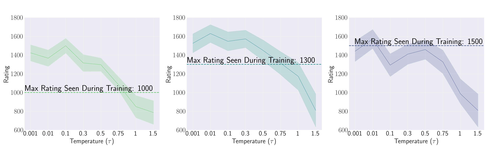
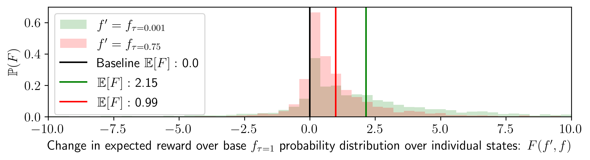
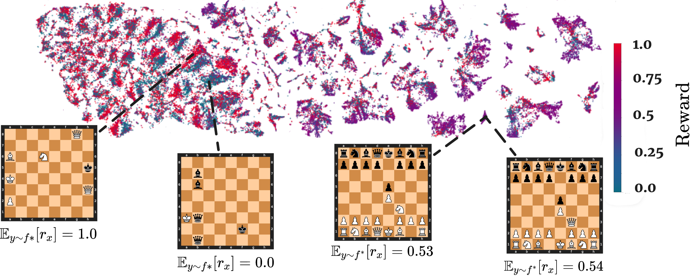
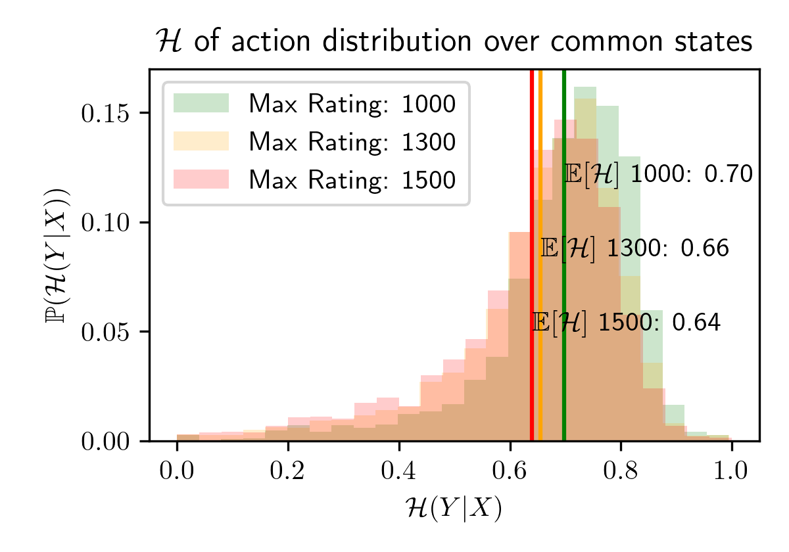

# Resumen de [1]

- Papper: https://arxiv.org/pdf/2406.11741v3
- Código de los experimentos: https://github.com/KempnerInstitute/chess-research
- Official online summary of the work: https://transcendence.eddie.win/ 

## Idea principal
- Modelo entrenado con partidas de ajedrez para predecir la siguiente jugada.
- Filtrando jugadores de ranking $\le 1000$ juego con rating $\approx 1500$.
- A este fenómeno ("jugar mejor que el mejor experto con el que entrenaste") lo llama *trascendencia*.
- Solo pasa al samplear a baja temparatura.
- La **hipótesis** es que los jugadores de bajo ranking cometen *blunders* no compartidos (errores no correlacionados, el papper los califica como *idiosyncratic*). Por eso los llama expertos ruidosos: en el fondo son expertos pero con ruido. El sampleo a baja temperatura equivale a un voto por mayoría que tiene un efecto de *denoising*.
- No pasa cuando se filtra ranking $\le 1500$: un jugador de 1000 se puede pensar como un jugador de 1500 ruidoso, pero uno de 1500 no se puede pensar como uno de 2000 ruidoso.
- Otra hipótesis, apoyada empíricamente es que es necesario *diversidad* en los datos.

 

## Formalización y predicciones teóricas
- $\mathcal{X}$: espacio de entradas: prefijos de partida.
- $\mathcal{Y}$: espacio finito de salidas (jugadas). Para Connect4 $|\mathcal{Y}|=7$, incluye jugadas ilegales (columnas llenas). Las políticas válidas le asignan probabilidad 0.
- $\mathcal{P}(\mathcal{Y})$ el conjunto de todas las distribuciones de probabilidad sobre $\mathcal{Y}$.
- $\mathcal{F}$: funciones $f: \mathcal{X} \to \mathcal{P}(\mathcal{Y})$, o sea una función que dado un prefijo de partida, calcula una distribución de probabilidad para la próxima jugada: $f(y \mid x)$ (también llamada política).
- Notaremos $k$ el número de expertos. Cada experto define una política $k$ **expertos** $f_1, \dots, f_k \in \mathcal{F}$.
- Distribución de entradas $p$ sobre $\mathcal{X}$ vistas durante el entrenamiento: que tan probable es observar el prefijo de partida $x$. Nota: $p$ depende de las políticas que se usaron para generar las partidas.
- Análogamente $p_{\text{test}}$ será la distribución de datos que se usa en la evaluación del modelo.
- Llamaremos **mezcla de expertos** y notaremos $f$ a:
$$
f(y \mid x) = \frac{1}{k} \sum_{i=1}^{k} f_i(y \mid x) \tag{1}
$$
- El learner durante su entrenamiento aprenderá de la distribución conjunta $D(x,y) = p(x)\, f(y \mid x)$. Esto equivale a decir que la formlación asume que los datos son generados muestreando $x \sim p$ y luego se eligiendo un experto **uniformemente al azar** para etiquetar

La formalización es una idealización.
En la práctica [1] toma datos reales donde
- el experto no se sortea por posición sino que es el mismo jugador durante toda la partida
- los jugadores no están igualmente representados
- las posiciones no se sortean sino que se alcanzan jugando.

- **Definición Recompensa** $r: \mathcal{X} \times \mathcal{Y} \to \mathbb{R}$, es una función externa que dice que tan buena es una jugada (solo para evaluar, no entrenar ; ver sección *analisis de mejoramiento*).

- Definimos la métrica "recompensa esperada" de una política $f$ en $p_{\text{test}}$:
$$
R_{p_{\text{test}}}(f) = \mathbb{E}_{x \sim p_{\text{test}}}\mathbb{E}_{y \sim f(\cdot \mid x)}\big[ r(x,y) \big] 
$$

Es la métrica que se utilzia en la formulación teórica de trascendencia.
No obstante, el resultado principal del papper no lo usa como medida de calidad: usa el rating de 300 partidas contra Stockfish.

Las pruebas de [1] asumen que $\forall x$ no es constante en $y$: $r(x,\cdot)$. Es un supuesto mas fuerte de lo que necesitan: bastaría con que No afecta mucho a las pruebas, en realidad bastaría con que $\exists x$ donde no sea constante con $p(x)>0$.

En nuestro trabajo denominamos a esos estados no triviales (en Connect4 aproximadamente la mitad de los estados son triviales). Y evaluamos recompensa solo en ellos.

El análisis de "favor" si lo usa. En la práctica lo calcula haciendo todas las jugadas válidas y evaluando la herística de Stockfish en cada nuevo estado para calcular la probabildiad de perder/empatar/garnar.

- **El learner** entrenado ideal (datos infinitos, capacidad infinita) es definido como:
$$
\hat f = \arg\min_{f \in \mathcal{F}} \mathbb{E}_{x \sim p}\, H(f, \cdot)
$$
Dónde $H$ es cross-entropy loss function.

- **Teorema:** el mínimo es exactamente la mezcla: $\hat f = f$.

- **Definición trascendencia** Una configuración $(f_1, \dots, f_k, p)$ exhibe trascendencia si el learner entrenado supera al **mejor experto individual**:

$$
R_{p_{\text{test}}}(\hat f) > \max_{i \in [k]} R_{p_{\text{test}}}(f_i) \tag{3}
$$

- **Teorema:** A temperatura 1 la trascendencia es imposible. Como el modelo aprende la mezca y la recompensa es lineal en la distribución, un problema nunca supera al máximo.
- **Teorema:** baja temperatura es una condición necesaria y suficiente para trascender.
A $\tau = 0$, se toma el arg-max de la mezcla $f$, lo que equivale a un voto por mayoría.

- **Teorema:** en un contexto donde los datos provienen de ser generados por un experto ruidoso (juega aleatoriamente con probabilidad $\rho$ y perfecto con $1-\rho$), hay trascendencia a temperatura suficientemente baja.
- **Teorema:**  en un contexto donde el espacio de estados se parte en $k$ regiones y los datos los generan $k$ expertos complementarios (el experto $i$ juega perfecto en su región $X_i$ y aleatoriamente fuera de ella), hay trascendencia a temperatura suficientemente baja, siempre que la distribución de test toque al menos dos regiones.

Nota: estos teoremas se basen en el setup teórico. En la distribución de estados $p(x)$ es algo externo, fijo, e independiente de las políticas de los expertos. En la realidad, y especialmente si tenemos expertos con políticas distintas como en este último teorema, tiene sentido que los estados visitados por cada experto sean distinto porque la propia policy del experto llevará la partida a posiciones distintas. [1] lo reconoce como una simplificación y [2] si lo tiene en cuenta en su formalización con una $p_i$ por experto.

- **Definición Mejoramiento (o *favor*)** de una política $f'$ respecto de $f$ en la posición $x$:

$$F(f', f; x) = \mathbb{E}_{y \sim f'(\cdot|x)}[r(x,y)] - \mathbb{E}_{y \sim f(\cdot|x)}[r(x,y)] = r_x(f') - r_x(f)$$

Expresa cuánto mejor es la recompensa esperada de lo que juega $f'$ que la de lo que hubiera jugado $f$ en esa misma posición.

Se utiliza en el experimento *analisis de mejoramiento* (más abajo) que intenta arrojar luz sobre cómo se distribuye la mejora en la recompensa, intuitivamente: la ganancia viene de mejorar un poquito en muchos estados o mejorar mucho en pocos estados? La hipótesis es que los jugadores de ranking bajo juegan bien casi siempre y arruinan la partida en errores puntuales.

- **Definición Mejoramiento (o *favor*) Global**:  es el promedio de este mejoramiento sobre los estados que se visitan al jugar con $f'$:

$$\mathbb{E}_{x \sim d{f'}}\big[F(f', f; x)\big]$$
onde $d_{f'}$ es la distribución de visita de estados al seguir $f'$. La elección de $d_{f'}$ y no $d_f$ está inspirada en el *Performance Difference Lemma* de *Reinforcement Learning*.

## Experimentos: detalles, resultados y conclusiones

### Construcción del conjunto de entrenamiento

- En formualción teórica asume $p(x) \geq 0 \ \forall x$ (de lo contrario el learner no podría aprender nada de ella).
- En formulación teórica trata $p$ como fija y externa:
>"We leave a complete analysis of a more general setting to future work"). 
- En experimentos existen tres dataset $D_1 \subseteq D_2 \subseteq D3$ donde se filtran las partidas sólo considerando las que el participante de más ranking tiene ranking 1000, 1300, y 1500 respectivamente.
- Parte este conjunto de desarrollo en entrenamiento/validación 95/5 a nivel partidas. El conjunto de validación se usa para monitoreo, no hay early stopping.

### Definición del método de evaluación

- Rating Glicko-2 jugando 300 partidas contra Stockfish niveles 1, 3 y 5, mitad con blancas y mitad con negras.
- Reportan $R \pm 2\,RD$ (que corresponde a un índice de confianza del 95%)
- Temperaturas evaluadas: 0.001, 0.01, 0.1, 0.3, 0.5, 0.75, 1.0, 1.5.
- Las partidas largas (más de 89 movimientos) son empate por decreto
- En limitations se señala:
> "our theoretical framework assumes that game conditions at test time match those seen during training"

#### Como se calcula el rating:
- El rating elo se calcula haciendo jugar al modelo entrenado contra Stockfish de nivel 1, 2, 3, 4 y 5 para el cual se conocen los rankings (1554, 1759, 1867, 2006, y 2148).
- Se usa los elos de los Stockfish y el ratio de victoria contra el mismo para calcular el ranking del modelo entrnado.
- Los elos de los Stockfish no es algo que esté disponible: los pre-calcula el mismo papper haciendo jugar a dichos Stockfish vs bots Maia (otra heurística que sí imitan jugadores humanos de cierto elo).

#### Sobre el sampleo de partidas

En la formulación el modelo predice la siguiente jugada.
Pero en la práctica el modelo predice un caracter.
Una jugada son varios caracteres.
El sampleo de una jugada funciona así:
- Se generan 10 caracteres.
- Se samplea un caracter a la vez, según la distribución calculada por el modelo entrenado (no se utiliza un decoding sofisticado como beam search).
- Se toma la siguiente palabra (el separador entre jugadas es el espacio en la notación PNG).
- Se repite si el modelo genera una jugada ilegal (5 intentos, sino pierde).
Esta sutilizea es importante porque determina un gap entre la formulación teórica y la práctica: el arg-max por caracter no es necesariamente el arg-max por jugada

### Régimen de entrenamiento
- **Modelo:** nanoGPT de Karparthy de 50M parámetros.
- **Objetivo de entrenamiento**: next-token prediction
- **Representación de la entrada y tokenización**: strings PGN (`1.e4 e5 2.Nf3 ...`) tokenización a nivel de carácter (32 símbolos).
Nunca ve el tablero ni las reglas, sólo el texto de las jugadas y el resultado (nota: esto es confuso, el papper dice que ve el resultado pero en el código que comparten no lo incluyen). No recibe rating ni recompensa durante el entrenamiento.
- **Datos:** ~1B partidas humanas de lichess.org (ene–oct 2023). Se crean tres datasets filtrando por $\text{max}(\text{rating}_1,\text{rating}_2) \leq L_{\text{dataset}}$ con $L_{\text{dataset}} \in \{1000, 1300, 1500\}$

- **Régimen de entrenamiento y cómputo usado**
    - Optimizador: AdamW, lr 3e-4 con cosine decay hasta 3e-5, 2000 pasos de warmup, weight decay 0.1, β=(0.9, 0.95), grad clip 1.0, bf16.
    - En la práctica se cortó antes de que terminase el learning rate schedule, así que es como si se hubiera entrenado con un learning rate ~ 3e-4
    - Activación: el paper dice ReLU, el código usa GELU (nanoGPT). Sin bias, dropout 0, 16 capas, 8 cabezas, 512 dims, vocab 32, block 1023.
    - Pasos de descenso por gradiente: 100.000
    - Mini-batch size: paper declara 125K tokens, en realidad ~128K = 1023 block_size (tokens/secuencia) . 125 batch_size (secuencias/batch).
    - Tokens vistos: 100K × 128K ≈ 13B tokens
    - gradient_accumulation_steps, evidencia confusa: el papper declara 1 y el código muestra 4
    - El modelo no llega a ver nunca la totalidad de los datos de 1B de partidas.
    - Cómputo: entre 6 y 12 h por modelo usando 1 H100 80GB. Pero el código muestra que entrenaron con DDP en 4 GPUs.
Los 3 modelos entrenados (en los 3 datasets filtrados) están en Hugging Faces.
En el repositorio están los config de la arquitectura del trasnformer específicamente.

### Análisis explicativos

#### Analisis de mejoramiento (favor)

- Juegan 100 partidas modelo ya entrenado y usando baja temperatura (0.001) vs Stockfish para fijar el conjunto de datos de evaluación. Se toman sólo las posiciones donde le tocaba jugar al modelo.
- En dicho conjunto se muestrean qué hubiera jugado a temperatura 0.001, 0.75 y 1 (se toman 100 sampleos por jugada).
- Teniendo aproximadamente 38.2 jugadas por partida se tienen 382.000 jugadas contrafácticas: $38.2 \times 100 \times 100$.
- Se calcula el mejoramiento como utilizando la formulación de arriba y calculando $r(x,y)$ utilizando la heurística de Stockfish que devuelve la probabilidad de ganar en el estado $x'$ que resulta de mover $y$ estando en $x$.
- **Resultado:** grafica el histograma de la distribución del "mejoramiento": el eje x es el favor y el eje y la frecuencia relativa de los estados que muestran dicho "mejoramiento". Visualmente corrobora que está sesagada a la derecha con una cola larga, corroborando la hipótesis: la ganancia proviene de pocos estados claves.

- Las muestras ilegales se cuentan con recompensa 0. A temperatura 1 hay posiciones con hasta 35 de 100 muestras ilegales, y a 0.001 casi ninguna. Eso infla el favor a favor de la temperatura baja, porque en juego real una jugada ilegal se podría re-muestrea infinitas veces (no sólo 5).

Nota conceptual: referencias el *Performance Difference Lemma* de *Reinforcement Learning* que dice que la diferencia de rendimiento entre dos políticas es la ventaja promedidad sobre los estados que visita la política nueva. Es por ello que las 100 partidas se construyen haciendo jugar al modelo a baja temperatura.

#### Análisis de generalización a estados no vistos

- La teoría asume que los expertos están definidos sobre todo $\mathcal{X}$. 
- En ajedrez, después de la jugada ~16 casi todo tablero aparece una sola vez en el dataset ([1] lo corrobora empíricamente en su repositorio)
- Sin embargo la trascendencia aparece, por qué?
- **Hipótesis de [1]:** el modelo comprime las partidas a una representación latente compartida entre posiciones *similares*. El denoising actúa también a este nivel, por lo que se extiende a estados no vistos pero *similares* a los vistos.
- **Experimento:** proyectan en 2D (usando t-SNE) el vector de la última capa oculta. Grafican cada punto con un color que depende de la probabilidad de que ganen las blancas según Stockfish. Observación: no se toma la probabilidad de que gane el jugador actual (lo que definimos como reward), porque esa cantidad se invierte en cada cambio de turno, y se busca que el color de una partida evolucione de forma continua con el correr de las jugadas.
- **Resultado:** se forman clusters donde las posiciones decididas (reward 0, 1) y las posiciones equilibradas (reward 0.5) quedan respectivamente juntas.
- **Conclusion:** la representación latente captra la ventaja relativa de la posiciones e identidad de los jugadores.

#### Análisis de diversidad y entropía del dataset

- En el dataset con elo hasta 1500 la trascendencia no se observa, por qué?
- **Hipótesis:** Un jugador de 1000 se puede pensar como un 1500 ruidoso, pero un 1500 no se puede pensar como un 2000 ruidoso.
- La propuesta es medir la diversidad de cada dataset como la **entropía normalizada de la distribución de acciones**

$$
H_f(Y \mid X) = \frac{\mathbb{E}_{y \sim f(y \mid x = X)}\big[-\log_2 f(y \mid x = X)\big]}{\log_2 |\mathcal{Y}|} \in [0, 1]
$$
- **Resultado:** $\text{entropía}(D_{1000}) > \text{entropía}(D_{1300}) > \text{entropía}(D_{1500})$. El dataset que no trascendió es el menos diverso.

- **Conclusión:** la diversidad es una condición necesaria para la trascendencia.
- Detalles de implementación:
    - Definen posición frecuente como aquel que aparece más de 100 veces. (posición = tablero, no prefijo PNG)
    - Para cada uno calculan la entropía de su distribución de jugadas (ver formula abajo).
    - Promedian dichas entropías (sin ponderaciones).
    - En el paper dicen que normalizan teniendo en cuenta las jugadas legales, pero en el código lo hacen por la cantidad de jugadas distintas que se observaron en esa posición dentro del dataset:
$$
H(x) = \frac{-\sum_{y \in A(x)} \hat f(y \mid x)\, \log_2 \hat f(y \mid x)}{\log_2 |A(x)|}, \qquad A(x) = \{\, y : \hat f(y \mid x) > 0 \,\}
$$

Esto podría inflar la entropía de las posiciones con pocas apariciones

- Sutilezas y críticas ala implementación de [1]:
    - En el papper declaran la limitación de que sólo están teniendo aperturas y finales (ya que son las únicas que pueden ser frecuentes). Pero la realidad de su implementación es que cortan luego de la jugada 16
    - Compara una métrica entre datasets pero las posiciones frecuentes dependen del dataset ya que son datasets anidados (usa la misma constante 100 para los 3 por más que cada uno incluye al otro). En $D_{1500}$ las posiciones frecuentes tienen más apariciones, por lo tanto más jugadas distintas observadas, por lo tanto denominador más grande y entropía normalizada más baja, aunque la distribución subyacente fuera idéntica.
    - El promedio es sin pesos, no es la entropía condicional de la teoría.
    - Hay una explicación más simple del resultado que no habla de diversidad:  $D_{1500}$ tiene menos errores que cancelar y el techo de la trascendencia está más cerca.
    

## Evidencia fuera del ajedrez

- **SQuAD v2 (QA en lenguaje natural):** LLMs ya entrenados responden mejor preguntas de comprensión lectora a temperatura baja. 
Muestra que bajar la temperatura ayuda, pero no mide trascendencia: no hay expertos contra los que comparar.

- **Toy model lineal:** 
    - Construye un dataset sintético.
    - x son vectores gaussianos de 100 dimensiones.
    - determina etiqueta verdaera $y = \arg\max_i W^{*}_i x$, con $W^{*}$ una matriz fija de $10 \times d$ (un separador lineal por clase)
    - $k = 5$ expertos son copias ruidosas de ese separador: el experto $j$ etiqueta con $W_j = W^{*} + \xi_j$, donde cada entrada de $\xi_j$ es $\mathcal{N}(0, \sigma^2)$ independiente.
    - 10K ejemplos etiquetados por expertos al azar
    - Se entrena un modelo lineal con cross-entropy loss.
    - Se mide la accuracy de test del modelo a distintas temperaturas y se la compara con la del mejor experto. 
    - **Resultado:* hay trascendencia a temperatura baja cuando $\sigma$ es grande, y no la hay cuando $\sigma$ es chico.
    - Replica mejor la formulación teórica: A diferencia de lo que sucede en los juegos $p$ es gaussiana, fija y externa. Y los expertos uniformemente representados en el dataset.
    - **Gaps en este toy setting:**
        - Los errores de los expertos nunca están correlacionados: el toy model sólo cubre el caso de error independiente.
        -  $\sigma$ afecta a la vez: cuánto se equivoca cada experto y cuánto difieren los expertos entre sí. El resultado "con $\sigma$ chico no hay trascendencia" no prueba si es por falta de diversidad o porque el mejor experto es ya casi perfecto.

### Posicionamiento de mi trabajo respecto de [1]

#### Decisiones

- Respecto a $p$ vs $p_{\text{test}}$ lo que nos va a importar es que estemos evaluando bien *trascendencia*: comparar el modelo vs los expertos.
- No es correcto comparar la recompensa entre configuraciones (porque tienen distribuciones distintas). Pero sí comparar *trascendencia* entre configuraciones.
- La métrica "score contra el bot" es correcta para comparar configuraciones.

#### Limitaciones de [1] que voy a intentar cubrir
- La entropía sólo se mide en estados frecuentes (aperturas/finales), no en el medio juego donde se deciden las partidas.
- No distinguen trascendencia en estados vistos vs no vistos.
- [1] asume el mismo $p$ para todos los expertos, soporte total ($p(x)>0 \ \forall x$) y expertos muestreados uniformemente en cada estado. Pero la política de cada experto influye en qué estados visita, induciendo un $p_{\text{experto}}$ distinto. El modelo podría aprender una mezcla con pesos de $P(\text{experto} \mid x)$ dependiendo del estado, por lo que la trascendencia podría darse también por ponderación bayesiana (no sólo por voto de la mayoría que es lo que estudia el trabajo).
- [1] es conciente y señala esta limitación. Y aclara que el trabajo no cubre composición ni razonamiento.
- [1] aclara que no hay evidencia de que el modelo produzca soluciones que un humano no podría idear. Nuestro trabajo tampoco estudiará esto ya que nuestro aprendizaje también es por imitación, no esperamos descubrimiento.
- Los analisis de [1] sustentan su hipótesis que los blunders (errores) ocurren en pocas posiciones y están decorrelacionados entre expertos (por ello el denoising funciona). Pero no estudian si dichos blunders son errores sistemáticos del mismo jugador o despistes casuales, sólo le importa que estén no correlacionados entre expertos distintos. Nosotros podemos estudiar ambos escenarios.

#### Checks metodológicos

- Agregar un test set de referencia fijo entre configuraciones si queremos comparar métricas entre configuraciones.
- Reportar la fracción visto/no visto train vs test para cada configuración y contra el test de referencia.
- Cuantificar cuánto se mueve $p$ entre configuraciones de alguna manera.

- **NO** crearía un $p$ con un generador fijo.

### DUDAS

- El modelo no puede identificar qué experto está jugando en función al prefijo (la política condiciona toda la partida). Esto no puede ser un problema para que el modelo aprenda "el promedio de los expertos"?
- Para el experimento 2 (jugar por regiones), samplear por jugada. Si elegís por partida, puede que los expertos tengan $p$ distinto entre ellos.