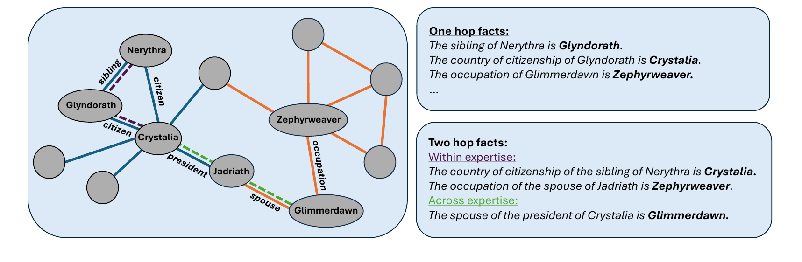
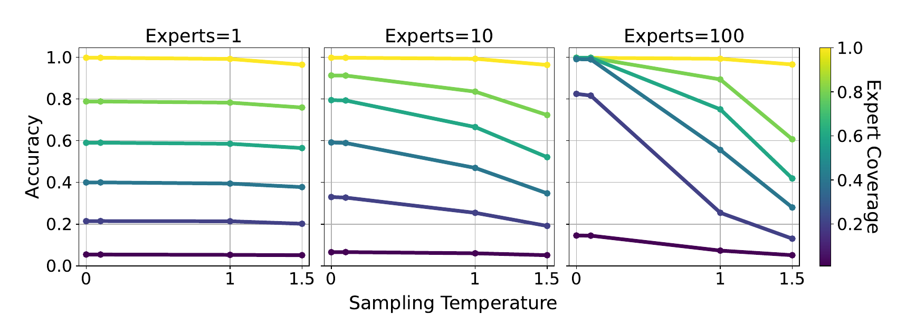
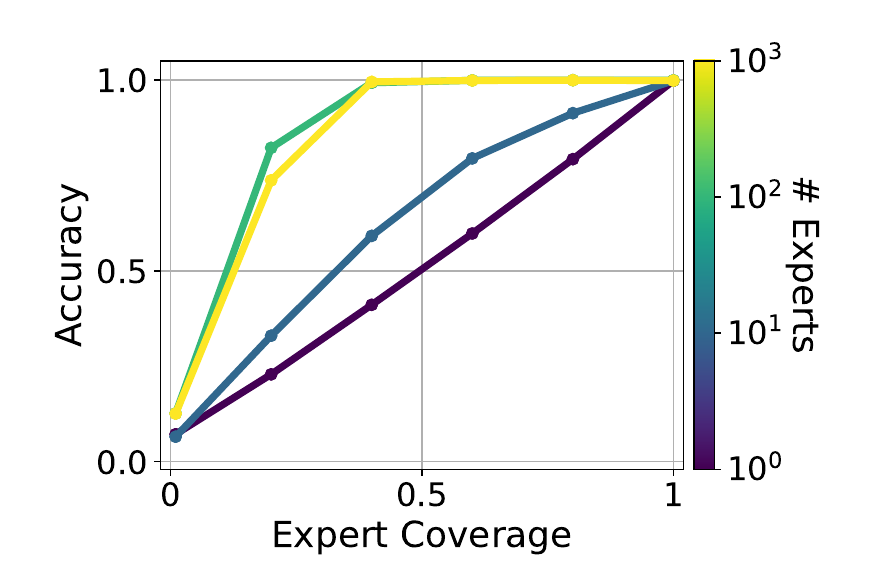
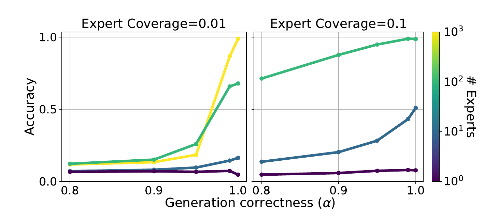
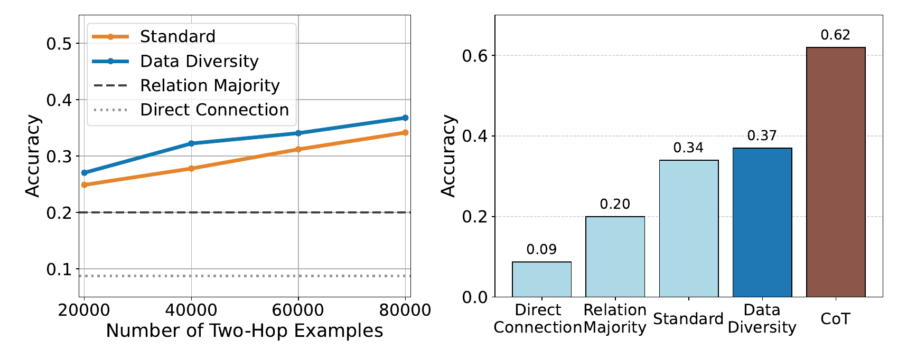
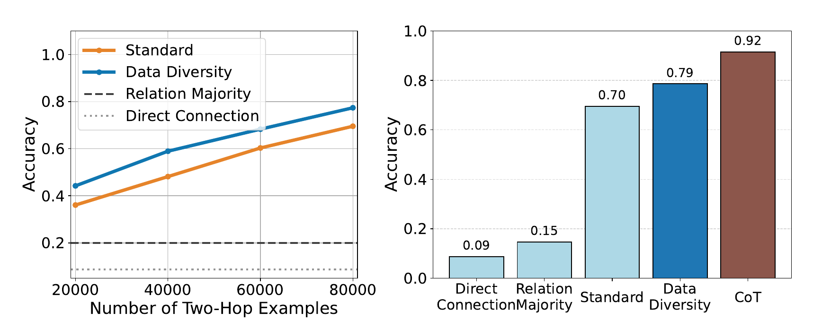

# Resumen de [2]

- Papper: https://arxiv.org/abs/2508.17669
- Código de los experimentos: (no está linkeado, surge del github de autores):
    - https://github.com/natalieabreu/transcendence: generación de expertos y datasets
    - https://github.com/natalieabreu/kg_multihop: tiene entrenamiento y evaluación
    fork de `bellecarrell/twohop` (Annabelle Carrell, mencionada en los agradecimientos), que a su vez parte del código de RippleEdits de Cohen et al. 2023. Parece incluir sólo denoising.

## Idea principal

- Continuar el trabajo de [1] y estudiar por qué ocurre la trascendencia.
- Idea: el modelo entrenado imita a un grupo.
- Luego la trascendencia ocurre cuando el grupo supera a cada integrante.
- Ellos proponen que esto pasa por tres mecanismos distintos (los denomina **modos de trascendencia**): 

- Un modelo entrenado por imitación no imita a *una* persona: imita a un *grupo*. El grupo puede superar a cada integrante de tres formas distintas.
- El papper formaliza esas tres formas como **modos de trascendencia** y para cada uno da (a) una condición sobre los datos de entrenamiento y (b) un experimento sintético que la verifica:
    - **Skill denoising** (cancelación de errores): todos los expertos hablan de todo, cada uno se equivoca en cosas distintas, el voto por mayoría (baja temperatura) acierta. Es [1].
    - **Skill selection** (selección / ruteo): cada experto sabe de una región; la clave es que **habla más de la región que sabe**. El modelo aprende a dar la respuesta del experto que más aparece en ese contexto. Acá los errores de los no-expertos pueden estar correlacionados y el voto fallar igual.
    - **Skill generalization** (composición): la pregunta no la sabe nadie; el modelo combina conocimiento de dos expertos distintos en un espacio latente compartido.
- La analogía humana que usan: votar; derivar la pregunta al criptógrafo o al abogado; que criptógrafo y abogado razonen juntos sobre la legalidad de un embargo algorítmico.
- Aclaran que la combinación de muchas personas también puede **amplificar los sesgos compartidos** (citan *stochastic parrots*, Bender et al. 2021). El papper estudia el otro lado: cuándo la diversidad del grupo le gana al individuo. El ejemplo motivador es un chatbot que habla con igual competencia de criptografía, derecho internacional y Dostoievski.
- Cuándo aplica cada modo, según la intro: denoising cuando todos los expertos producen datos relevantes para la entrada pero con errores independientes; selection cuando la entrada le es familiar a *al menos un* experto (y ese experto la encuentra más seguido); generalization cuando la entrada no le es familiar a *ninguno* pero se entiende por generalización.
- La tesis transversal: el modelo trasciende sólo si el conjunto de expertos es suficientemente **heterogéneo**. "Diversidad" quiere decir cosas distintas en cada modo: errores no correlacionados, expertises variadas, fraseos y composiciones variadas.
- Contribución adicional que reivindican: el *testbed* de grafo de conocimiento con expertos simulados, como banco controlado para trabajo futuro.
- Diferencia de dominio con [1]: no hay juego ni secuencia de decisiones. Cada consulta es un hecho aislado (head, relation, tail). La verdad se conoce por construcción (no hace falta Stockfish).

## Formalización

- Copian la notación de [1] y la amplían. Cambios:
    - $\mathcal{X} = \mathcal{T}^n$, $\mathcal{Y} = \mathcal{T}^m$: entradas y salidas son secuencias de tokens de un vocabulario $\mathcal{T}$.
    - $k$ expertos $f_1, \dots, f_k$, **cada uno con su propia distribución de entradas** $p_i$. En [1] había una sola $p$ para todos; esto es justo la simplificación que [1] dejó como trabajo futuro y que yo anoté en mi resumen de [1].
    - El learner elige dentro de una **clase de hipótesis** $\mathcal{H}$, no de toda $\mathcal{F}$. Esto habilita hablar de sesgo de simplicidad en generalización.
- $\bar p(x) = \frac{1}{k}\sum_i p_i(x)$: distribución de entradas promedio. $\operatorname{supp}(\bar p)$ su soporte.
- **Mezcla de expertos**, ahora ponderada por estado:
$$\bar f(y \mid x) = \sum_{i=1}^{k} g(i \mid x)\, f_i(y \mid x)$$
donde $g(i \mid x)$ es "la probabilidad condicional de que $x$ haya sido observado bajo el experto $i$".
- El papper no escribe la fórmula de $g$. Con prior uniforme sobre expertos (cada uno genera la misma cantidad de muestras, que es lo que hacen) es Bayes:
$$g(i \mid x) = \frac{p_i(x)}{\sum_j p_j(x)} = \frac{p_i(x)}{k\, \bar p(x)}$$
Si todos los $p_i$ son iguales, $g \equiv 1/k$ y se recupera la mezcla uniforme de [1].
- Cada experto induce $\mathcal{D}_i(x, y) = p_i(x) f_i(y \mid x)$ y los datos vienen de $\bar{\mathcal{D}} = \frac{1}{k}\sum_i \mathcal{D}_i$. Se verifica que $\bar{\mathcal{D}}(x,y) = \bar p(x)\, \bar f(y \mid x)$, o sea: los datos son "samplear $x \sim \bar p$ y etiquetar con la mezcla ponderada".
- Recompensa y recompensa esperada: igual que [1]. $r_x(f) = \mathbb{E}_{y \sim f(\cdot \mid x)}[r(x, y)]$ y $R_p(f) = \mathbb{E}_{x \sim p}[r_x(f)]$.
- **Learner**:
$$h_{\bar{\mathcal{D}}} = \arg\min_{h \in \mathcal{H}} \mathbb{E}_{x \sim \bar p}\big[ H(\bar f(\cdot \mid x),\, h(\cdot \mid x)) \big]$$
Equivale a minimizar cross-entropy sobre $\bar{\mathcal{D}}$. Si $\mathcal{H}$ es irrestricta y hay datos infinitos, $h_{\bar{\mathcal{D}}} = \bar f$.
- **Definición trascendencia**: la misma de [1], $R_{p_{\text{test}}}(h_{\bar{\mathcal{D}}}) > \max_i R_{p_{\text{test}}}(f_i)$.
- Los tres modos se definen por qué supuestos se mantienen:

| Supuesto | Denoising | Selection | Generalization |
|---|---|---|---|
| (1) Misma $p$ para todos: $p_i = \bar p$ | sí | **no** | no |
| (2) Test in-domain: $\operatorname{supp}(p_{\text{test}}) \subseteq \operatorname{supp}(\bar p)$ | sí | sí | **no**: $\operatorname{supp}(p_{\text{test}}) \cap \operatorname{supp}(\bar p) = \emptyset$ |

### Skill denoising (formal)
- Supuestos (1) y (2). Es el setting de [1]: a baja temperatura se devuelve la moda de la mezcla = voto por mayoría; funciona si los errores no están correlacionados. No agregan teoría nueva.

### Skill selection (formal)
- Se elimina el supuesto (1). Los expertos son *especialistas*: cada uno tiene una *expertise* = subconjunto de entradas donde responde bien.
- **Afirmación**: hay trascendencia cuando un contexto $x$ es más probable de observarse bajo los expertos que tienen más recompensa en $x$. Formalmente, $g(i \mid x)$ **depende de $x$** en vez de ser constante. "El abogado comenta más sobre preguntas de derecho".
- **Teorema 2.1** (dos expertos $a$ y $b$). Para que haya trascendencia se debe cumplir:
$$\mathbb{E}_{x \sim p_{\text{test}}}\Big[ \big(r_x(f_a) - r_x(f_b)\big)\,\big(g(a \mid x) - g(b \mid x)\big) \Big] > 0$$
El exceso de presencia de $a$ en $x$ tiene que estar correlacionado con el exceso de recompensa de $a$ en $x$.
- Es condición **necesaria**, no suficiente (así lo enuncian: "for transcendence to hold, we must have").
- **La prueba** (Apéndice A.1) asume $h_{\bar{\mathcal{D}}} = \bar f$ y evalúa **a temperatura 1**. Con $g(a|x) + g(b|x) = 1$:
$$R(\bar f) - R(f_a) = \mathbb{E}\big[ g(a|x) r_x(f_a) + (1 - g(a|x)) r_x(f_b) - r_x(f_a) \big] = \mathbb{E}\big[ g(b|x)\,(r_x(f_b) - r_x(f_a)) \big] > 0$$
y simétricamente $\mathbb{E}[g(a|x)(r_x(f_a) - r_x(f_b))] > 0$. Sumando ambas sale el enunciado.
- Notas mías sobre el teorema:
    - Las dos desigualdades intermedias son la condición exacta (necesaria y suficiente dado $h = \bar f$); el teorema las suma en una sola, más débil.
    - Es trascendencia **a temperatura 1**, que [1] probó imposible con $p$ compartida. Lo que la habilita es que $g$ dependa de $x$: **ponderación bayesiana** de los expertos en vez de voto uniforme. Esto confirma la sospecha que anoté en mi resumen de [1].
    - $g$ está definida por los $p_i$ de entrenamiento pero la esperanza es bajo $p_{\text{test}}$. En sus experimentos $p_{\text{test}}$ = uniforme sobre los hechos verdaderos.
    - No hay teoría de selección a baja temperatura. En los experimentos de selection usan greedy decoding (ver abajo), así que lo que miden combina selección (ponderación $g$) con denoising (arg-max). No los separan.

### Skill generalization (formal)
- Se elimina el supuesto (2) y se asume lo contrario: $\operatorname{supp}(p_{\text{test}}) \cap \operatorname{supp}(\bar p) = \emptyset$. Nada de test se vio en train.
- ¿Cómo responde bien si ningún experto puede? Si el conocimiento de los expertos es representable en un **espacio latente compartido**, el modelo puede componer conocimiento de distintos expertos.
- La tarea concreta: **completar hechos de dos saltos** (two-hop). Cada experto conoce hechos de un salto y puede responder preguntas de dos saltos *dentro* de su conocimiento. Las preguntas de test necesitan un salto de un experto y el otro de otro: nadie tiene los dos.
- **Hipótesis**: si el learner está sesgado hacia soluciones simples, y componer es más simple que memorizar todas las entradas de dos saltos, el modelo generaliza componiendo piezas reutilizables de un salto. Lo formalizan en el Apéndice A.2 (ver sección propia más abajo).
- Nota: formalmente, $\max_i R_{p_{\text{test}}}(f_i)$ es trivial acá porque ningún experto está definido en el test. La vara real contra la que comparan son dos baselines de "atajo" estadístico (ver experimentos), no los expertos.

- De la Figura 1: en generalization los **expertos no tienen errores**. Lo dicen en el caption, no en el texto. Es importante: el tercer modo se estudia sin ruido.

## Experimentos: detalles, resultados y conclusiones

### Construcción del grafo de conocimiento (dataset base)

- Grafo verdad $G = (V, E)$. Nodos = entidades, aristas = hechos (head, relation, tail).
- **Estructura** tomada del grafo basado en WIKIDATA de Cohen et al. 2023 (el papper de *ripple effects* de knowledge editing).
- **Entidades renombradas con nombres ficticios** generados por GPT-4o-mini, para garantizar que el modelo preentrenado nunca vio esos hechos. Procedimiento (Apéndice B.1):
    - Se piden nombres de países ficticios como semilla y se asignan al azar a los países del grafo original.
    - Se recorre el grafo tipo BFS. Para cada nodo se le pide a GPT-4o-mini un nombre ficticio usando como contexto a sus vecinos ya renombrados, más una letra inicial aleatoria para diversidad.
- Tamaño: **~25.000 entidades, 39 tipos de relación, 54.500 aristas**.
- Cada entidad tiene un **tipo semántico** (país, persona, ocupación, ...).
- **Creencia incorrecta = arista corrupta**: se toma un hecho verdadero y se reemplaza el head *o* el tail por otra entidad **del mismo tipo** (para que siga siendo sintácticamente plausible). Nota: si se reemplaza el head, el prefijo "(head, relation)" verdadero desaparece de los datos de ese experto; el papper no distingue los dos casos.
- Cada experto $i$ tiene un **grafo personal** $G_i$: una cantidad predefinida de conocimiento correcto más creencias incorrectas. Cómo se arma depende del modo (abajo).
- Para selection y generalization: **clustering espectral sobre las aristas**, **5.000 clusters** = áreas de expertise potenciales. Son ~11 aristas por cluster en promedio. A cada experto se le asigna conocimiento de uno o más clusters.

### Cómo se generan los datos de entrenamiento

- Cada muestra es un **párrafo sobre una entidad**, emulando a un experto que escribe sobre un tema.
- Para $N$ muestras con $n_e$ expertos, cada experto genera $N / n_e$ (salvo que se indique otra cosa).
- Para generar una muestra: se samplea un nodo **uniformemente al azar** del grafo personal del experto, y se escribe una oración templada por cada arista conectada a ese nodo: "The {relation} of {head} is {tail}.". Las oraciones van en orden aleatorio.
- Un párrafo incluye *todas* las aristas del nodo, correctas y corruptas. Así es como entran los errores a los datos.
- Esto corresponde a la formalización así: $p_i$ = distribución inducida por "nodo uniforme en $G_i$ + sus aristas". En denoising todos los $G_i$ cubren todo el grafo, así que $p_i \approx \bar p$. En selection la perilla $\alpha$ (abajo) hace que $p_i$ se concentre en la expertise.

### Definición del método de evaluación

- Métrica: **query completion accuracy**. Para cada hecho del grafo verdad se arma el prompt "The {relation} of {head} is" y se compara la salida con el tail por **match exacto**. Si hay varios tails correctos, vale cualquiera.
- Es el porcentaje de los hechos verdaderos que el modelo **memorizó**. El papper lo dice con esas palabras.
- $p_{\text{test}}$ = uniforme sobre los 54.500 hechos verdaderos. En denoising y selection es in-domain por construcción: cada experto tiene (bien o mal) una versión de cada hecho.
- "Accuracy del experto" = su cobertura $c$: la fracción de hechos verdaderos que sabe. Esa es la vara de trascendencia.
- Decoding: **greedy** (temperatura 0) salvo que la figura muestre temperatura. Sólo la Figura 3 barre temperatura.
- No reportan semillas, varianza ni barras de error en ninguna figura.

### Régimen de entrenamiento

- **Modelo (denoising y selection)**: *finetuning* de **GPT-2 preentrenado**. No dicen qué tamaño. **En el código** (`kg_multihop/train/train_2.py`) es `"gpt2"`, o sea el chico de **124M**. Como las entidades son ficticias, el preentrenamiento no aporta hechos del grafo, sólo lenguaje.
- **Modelo (generalization)**: **LLaMA 3.2 de 1B** porque la tarea es más difícil. Experimentos preliminares: agrandar el modelo mejora poco el two-hop (consistente con Yang et al. 2024 y Allen-Zhu & Li 2024b).
- **Objetivo**: next-token prediction sobre los párrafos.
- **Optimización**: AdamW, lr $10^{-3}$, weight decay 0.1, 1000 pasos de warmup, cosine decay, batch size 24. Nota: lr $10^{-3}$ es alto para finetuning; no lo justifican.
- **Cantidad de datos por modo**:
    - Denoising: 10M muestras por configuración. Son ~400 párrafos por entidad, así que cada hecho recibe cientos de "votos" en el dataset (desde el head y desde el tail).
    - Selection: 1M párrafos, 10 épocas.
    - Generalization: 6M párrafos de un salto + 80.000 hechos de dos saltos repetidos 20 veces por época, 10 épocas.
- **Cómputo** (Apéndice B.2): 1 a 4 H100 por 1 a 8 horas por corrida.

### Experimento 1: skill denoising

- **Hipótesis**: si cada fuente se equivoca en hechos distintos, el voto colectivo acierta.
- **Construcción de los expertos**: todos comparten un **nivel de cobertura** $c \in [0, 1]$ = fracción del grafo que cada experto sabe bien. Para armar $G_i$ se recorre cada arista del grafo verdad: con probabilidad $c$ se incluye correcta, con $1 - c$ se incluye una versión corrupta.
- **Variable manipulada**: la cantidad de expertos $n_e$, **como proxy de errores no correlacionados**. Como los errores se samplean uniforme e independientemente por experto, más expertos → la distribución de errores en el dataset es más uniforme (los votos erróneos se reparten entre muchos tails distintos, el correcto concentra $c$ de los votos).
- Con $n_e = 1$ no hay nada que cancelar: la creencia errónea del único experto sobre una arista es determinista, el modelo la memoriza y la accuracy es $c$ a cualquier temperatura.
- Nota: cada experto individual *no* es un "experto ruidoso" en el sentido de la Prop. 3 de [1] (ruido uniforme por estado). Es determinista. El ruido uniforme emerge a nivel de la **población**. El mecanismo es el de la Prop. 4 de [1] (expertos complementarios) con las regiones elegidas al azar.
- **Resultados**:
    - Con suficientes expertos se supera ampliamente la cobertura individual. Con $c = 0.2$ y 100 expertos: **más de 80 % de accuracy**.
    - Figura 4 (cobertura vs accuracy, greedy): con 1 experto la curva es la diagonal (accuracy = $c$). Con 10 está arriba de la diagonal (leído del gráfico: $c = 0.4 \to$ ~0.58, $c = 0.8 \to$ ~0.93). Con 100 y 1000 se satura en ~1 a partir de $c \approx 0.4$.
    - Figura 3 (temperatura vs accuracy, para 1, 10, 100 expertos y coberturas de ~0.05 a 1; temperaturas 0, 1 y 1.5): con baja temperatura la accuracy sube; **a temperatura 1 queda cerca del nivel de cobertura** (la mezcla rinde como el experto promedio, como predice la Prop. 1 de [1]); a 1.5 baja aún más. Con 1 experto las curvas son planas.
- **Conclusión del papper**: la diversidad en forma de **errores no correlacionados** permite trascender por "sabiduría de las masas" con baja temperatura.

### Experimento 2: skill selection

- **Motivación**: en la realidad los no-expertos comparten *misconceptions*, los errores están correlacionados y el voto no garantiza nada. Pero el modelo puede superar a todos igual si da la respuesta de la fuente con la expertise relevante. Para eso los datos tienen que tener a cada experto **hablando más de lo que sabe que de lo que no sabe**.
- **Construcción de los expertos**:
    - Cobertura $c$ compartida.
    - Cada experto $i$ tiene un **vector de cobertura** $s_i = (s_i^{(1)}, \dots, s_i^{(5000)})$ con $s_i^{(j)} \in [0, 1]$ = accuracy del experto en las aristas del cluster $j$, sujeto a
$$\sum_{j=1}^{5000} s_i^{(j)}\, |C_j| = c \cdot |E|$$
    - Para cada arista $e \in C_j$: con probabilidad $s_i^{(j)}$ se incluye correcta, con $1 - s_i^{(j)}$ corrupta.
    - El papper **no especifica** cómo se eligen los $s_i^{(j)}$. **En el código** (`transcendence/src/dataset_generator.py`, `skill_selection`, `select_clusters` y `get_confidence_scores_lp`):
        - Cada experto elige clusters **al azar** (shuffle) hasta juntar `edges_per_expert` aristas.
        - Los $s_i^{(j)}$ de esos clusters salen de un **programa lineal**: maximizar $\sum_j s_i^{(j)}$ sujeto a $\sum_j |C_j|\, s_i^{(j)} = c\,|E|$ y $0 \le s \le 1$. La solución de un LP así cae en un vértice: casi todos los $s$ quedan en **0 o 1** y a lo sumo uno fraccionario. O sea, en la práctica la expertise es binaria por cluster.
        - Los clusters no elegidos quedan con $s = 0$: el experto los sabe **siempre mal**.
    - Corrupción (`get_modified_graph_over_edges`): con probabilidad $1 - s$ se reemplaza, con 50/50, el tail o el head por una entidad sorteada **uniformemente** entre las que aparecen como tail (o head) de esa misma relación. Eso es lo que el papper llama "entidad del mismo tipo". El sorteo es **independiente por experto**.
    - Conclusión: la sospecha era correcta. La motivación habla de misconceptions **compartidas**, pero lo implementado es "la mayoría se equivoca, cada uno a su manera". Lo que hace fallar al voto no es que coincidan en el error sino que son muchos más los que se equivocan.
- **Generación con la perilla $\alpha$**: se samplea un nodo uniforme del grafo personal como antes, pero ahora cada hecho conectado se escribe con probabilidad
$$p = \alpha\, s_i^{(j)} + (1 - \alpha), \qquad \alpha \in [0, 1]$$
donde $j$ es el cluster de la arista.
    - $\alpha = 1$: escribe cada hecho con probabilidad igual a su expertise en ese cluster. Si $s \in \{0, 1\}$, el experto **sólo escribe lo que sabe** y el dataset queda sin ruido.
    - $\alpha = 0$: escribe todo por igual, lo que sabe y lo que no.
    - $\alpha$ es la perilla de **cuánto habla cada experto de lo que no sabe**. Controla cuánto se concentra $p_i$ en la expertise, o sea cuánto depende $g(i \mid x)$ de $x$.
- **Resultados** (1M párrafos, 10 épocas; coberturas $c \in \{0.01, 0.1\}$; $\alpha \in [0.8, 1]$; expertos de 1 a 1000; Figura 5):
    - Para ambas coberturas, con suficientes expertos la accuracy llega a casi 1.
    - La accuracy mejora consistentemente con $\alpha$.
    - Con $c = 0.01$ la transición es **abrupta**: la accuracy es ~0.1 para $\alpha \le 0.95$ y sólo en $\alpha = 1$ sube (1000 expertos: ~1.0; 100 expertos: ~0.65).
    - Con $c = 0.1$ es gradual: 100 expertos van de ~0.7 ($\alpha = 0.8$) a ~1.0 ($\alpha = 1$); 10 expertos de ~0.1 a ~0.5; 1 experto queda plano en ~0.05.
    - El papper interpreta "más expertos = más diversidad de expertises".
- **Conclusión del papper**: con errores sesgados la trascendencia la habilita la diversidad de **expertises**. Para garantizarla, los expertos deben escribir más de su dominio que fuera de él.

- Notas y cuentas mías sobre este experimento:
    - **Techo sin generalización**: la accuracy no puede superar la fracción del grafo que *algún* experto sabe. Si los clusters se asignan al azar e independientemente, eso es $\approx 1 - (1 - c)^{n_e}$. Da 0.63 para $(c, n_e) = (0.01, 100)$ y 0.65 para $(0.1, 10)$; en la Figura 5 esos casos llegan a ~0.65 y ~0.5 en $\alpha = 1$. Es consistente con que a $\alpha = 1$ el modelo memoriza la unión de lo que saben todos. Para cubrir el grafo se necesita $n_e \cdot c \gtrsim 1$, y eso explica qué curvas despegan.
    - **Por qué la transición es abrupta con $c = 0.01$**: para un hecho dado, ~$n_e c$ expertos lo saben y lo escriben siempre ($p = 1$); los otros ~$n_e(1 - c)$ lo saben mal y lo escriben con probabilidad $1 - \alpha$. Con $(c, n_e) = (0.01, 100)$ hay 1 voto correcto contra $99(1 - \alpha)$ votos erróneos: 5 en $\alpha = 0.95$, 10 en $\alpha = 0.9$. Aunque los erróneos se repartan entre tails distintos, 1 voto correcto rara vez es la pluralidad. Con $c = 0.1$ son 10 votos correctos contra $90(1 - \alpha)$ y la cosa es gradual. Esto es un argumento de umbral sobre la **proporción de votos**, análogo al $\alpha^*$ de mi experimento 2.
    - Con $\alpha = 1$ y $s \in \{0, 1\}$ **no hay ruido en el dataset**, así que la "trascendencia" es que el modelo memoriza la unión de conocimientos. Es el caso extremo de la Prop. 4 de [1] pero sin necesidad de baja temperatura: los no-expertos callan, $g(i \mid x)$ se concentra en el experto. La parte interesante es $\alpha < 1$, y ahí lo que resuelve es el arg-max (greedy), o sea selección **más** denoising.
    - Sólo barren $\alpha \in [0.8, 1]$. Por debajo de 0.8 presumiblemente no anda; no lo muestran.

### Experimento 3: skill generalization

- **Idea**: en selection al menos un experto sabe la respuesta; acá **ninguno**. El modelo tiene que componer conocimiento de dos expertos usando representaciones compartidas.
- **Construcción de los expertos**: versión simplificada de selection. **Cada experto conoce un único cluster** y **sin errores** (Figura 1). El papper no dice cuántos expertos hay. **En el código** (`per_cluster_strategy`): el experto $i$ es exactamente el cluster $i$, con expertise one-hot y su grafo personal formado sólo por las aristas de ese cluster (no hay aristas corruptas). Con `num_experts = n` se usan los clusters $0, \dots, n-1$; no hay forma de saber qué $n$ usaron en el papper. Hay un caso especial de un solo experto que usa el cluster 4999, comentado como "baseline con el cluster más grande". Cada experto genera muestras **en proporción al tamaño de su cluster** (acá sí se aparta del $N / n_e$ uniforme).
- **Marco de evaluación**: el de Yang et al. 2024 (*Do LLMs latently perform multi-hop reasoning?*). Capacidad composicional **latente** = responder el hecho de dos saltos **sin generar la entidad intermedia**, sabiendo los hechos de un salto.
- **Dos tipos de hechos de dos saltos**:
    - **Within-expertise**: las dos aristas están en el mismo cluster. Algún experto sabe ambos saltos.
    - **Across-expertise**: las dos aristas están en clusters distintos. Nadie sabe ambos.
- **Datos**: 6M párrafos de un salto (como antes) + un conjunto de hechos **within-expertise de dos saltos** escritos como oraciones, para **enseñar el formato** de dos saltos. Se barre su tamaño: 20.000, 40.000, 60.000, **80.000** (todos). Se repiten 20 veces por época para saturar la accuracy en train. 10 épocas.
- **Conjuntos de evaluación**:
    - Un salto: todos los hechos.
    - **Validación within-expertise**: ~6.000 hechos de dos saltos within-expertise retenidos (6.133 según B.3.1). Mide composición *sin cruzar expertos*.
    - **Test across-expertise**: **64.811** hechos. Nunca vistos como dos saltos, y además requieren cruzar expertos. Es el test de generalización.
- **Baselines de "atajo"** (de Yang et al. 2024), porque la vara "mejor experto" es trivialmente 0 acá:
    - *Direct connection*: ¿hay una arista directa head–tail en los hechos de un salto? Cuenta pares head–tail que co-ocurren: 528/6.133 = **0.086** en validación, 5.666/64.811 = **0.087** en across. También chequearon co-ocurrencia head–tail en el set de dos saltos de train: <5 %, lo omiten.
    - *Relation majority*: responder la entidad del tipo correcto más frecuente para la segunda relación: **0.20** across, **0.15** within.
- **Resultados** (Figura 6 across; Figura 7 within, en apéndice):
    - Un salto: casi perfecto en todos los modelos.
    - Across-expertise crece **aproximadamente lineal** con la cantidad de ejemplos de dos saltos en train: ~0.25 (20.000) → **0.34** (80.000). Contra 0.20 de relation majority.
    - Within-expertise (validación): 0.36 → **0.70** en el mismo rango.
    - Lectura mía: componer dos hechos del *mismo* experto ya es difícil (0.70), y cruzar expertos cuesta otro tanto (0.34). La diferencia 0.70 vs 0.34 aísla el costo de cruzar expertos del costo de componer.
    - **Desafío central** que declaran: la cantidad de hechos de dos saltos que un experto individual conoce es **finita** (está acotada por los within-cluster). No se puede seguir agrandando el set. Por eso prueban dos alternativas.

#### Alternativa A: diversidad de fraseo (phrasing diversity)
- Inspirado en Allen-Zhu & Li 2024a (*Physics of LMs 3.1*): la augmentación por reescritura hace que el modelo forme mejores representaciones latentes en vez de memorizar el contexto.
- **Cuatro niveles de diversidad** (Tabla 1 del papper), uno por cada párrafo de un salto:
    1. Un template por relación (el estándar).
    2. Cuatro templates por relación, se elige uno al azar por arista.
    3. GPT-4o-mini reescribe el párrafo de nivel 1 con baja creatividad. Prompt: "You will be provided with a list of facts about an entity. Your job is to write a 10-50 word encyclopedia entry about the given entity. You should not make up additional information, just rewrite the facts."
    4. GPT-4o-mini reescribe el párrafo de nivel 2 con alta creatividad. Mismo prompt más "Use creative word choices and phrasing."
- En niveles 1 y 2 los hechos de dos saltos van en un único template. Para diversificarlos, se le pide a GPT-4o-mini que refrasee cada oración de dos saltos.
- Modelos "Data diversity": **1,5M párrafos distintos × 4 niveles = 6M muestras**. Mismo total que el estándar (6M), así que mismo cómputo pero 4 veces menos nodos sampleados. Más los dos saltos refraseados repetidos 20×/época junto con los templados.
- **Resultado**: diversidad en los párrafos de **un salto**: across 0.34 → **0.37** (within 0.70 → 0.79). Diversidad en los hechos de **dos saltos**: **sin efecto**. Dejan para futuro augmentaciones más principled.

#### Alternativa B: Chain-of-Thought
- Trabajos previos (Wei et al. 2023; Allen-Zhu & Li 2024b; Prystawski et al. 2023) encuentran CoT esencial para manipulación de conocimiento y multi-hop.
- **Formato** (B.3.4): QA con la entidad intermedia antes de la respuesta final, separada por punto y coma. Ejemplo: "What is the award received by the screenwriter of Glyndor Aetheralis? Ithryndor Glaciaris; Xyphorian Starblossom." En evaluación se le permite generar el paso intermedio y se juzga **sólo la respuesta final**.
- **Resultado**: across **0.62**, within 0.92.
- **Observación conceptual del papper**: cuando el modelo nombra explícitamente el nodo intermedio, **reduce el problema de generalización a uno de selección**: cada salto por separado lo sabe algún experto. Por eso CoT ayuda tanto. Y por eso 0.62 no es evidencia de composición latente.
- **Conclusión del papper sobre generalización**: es el modo más difícil pero los LMs lo logran (parcialmente). Se promueve con diversidad de formas superficiales y, más notoriamente, con **diversidad de composiciones** en los datos de entrenamiento. Ellos mismos lo califican de "nontrivial improvement over the 20% baseline".

### Análisis formal de generalización (Apéndice A.2)

- Caso de estudio para dar intuición de por qué un learner con sesgo de simplicidad prefiere componer. Basado en el setting del grafo.
- $G = (V, E)$, $R$ tipos de relación, arista $e = (a, r, b)$. $F^{(1)} = E$ = hechos de un salto. **Supuesto**: mapeo determinista, para cada prefijo $(a, r)$ hay a lo sumo un $b$. A $(a, r)$ lo llaman "entrada de un salto".
- Hecho de dos saltos $(a, r_1, r_2, c)$ con entidad puente $b$: $(a, r_1, b), (b, r_2, c) \in F^{(1)}$. Conjunto $F^{(2)}$. Función $f^*: V \times R \times R \to V$ definida sólo donde existe puente. $(a, r_1, r_2)$ es una "entrada de dos saltos".
- $f^*$ es **composicional**: $f^*(a, r_1, r_2) = g^*(g^*(a, r_1), r_2)$ con $g^*(a, r) = b$.
- $\mathcal{X}$ = entradas de dos saltos válidas. $\mathcal{Y} = V \cup \{\epsilon\}$, con $\epsilon$ etiqueta nula.
- Partición de los hechos de un salto en $k$ expertos $F_i^{(1)}$. Espacio de entrada del experto $i$:
$$\mathcal{X}_i = \{ (a, r_1, r_2) \mid \exists\, b, c : (a, r_1, b), (b, r_2, c) \in F_i^{(1)} \}$$
(las dos aristas en su partición). $p_i$ con soporte total en $\mathcal{X}_i$. El experto siempre etiqueta bien. Dataset $D$ de $N$ muestras únicas.
- Clase de hipótesis $\mathcal{H} = \mathcal{H}_{\text{mem}} \cup \mathcal{H}_{\text{comp}}$:
    - Memorizadores: una tabla $T^{(2)}$ de tamaño $V \times R \times R$, $h(a, r_1, r_2) = T^{(2)}[(a, r_1, r_2)]$.
    - Composicionales: una tabla $T^{(1)}$ de tamaño $V \times R$, $h(a, r_1, r_2) = g(g(a, r_1), r_2)$ con $g(a, r) = T^{(1)}[(a, r)]$.
- **Complejidad** $\kappa(T)$ = número de entradas no nulas de la tabla. Componer cuesta un overhead fijo: $\kappa(f(f(\cdot), \cdot)) = \kappa(f) + \kappa_{\text{comp}}$.
- ERM: $h_D \in \arg\min_{h \in \mathcal{H}} \mathbb{E}_{(x, y) \sim D}[H(y, h(x))]$. Es realizable, así que hay un conjunto $\mathcal{H}^*_D$ de hipótesis con loss cero. Cualquier memorizador de $D$ está ahí, pero no dice nada sobre dos saltos entre particiones.
- **Sesgo de simplicidad**: $h_D \in \arg\min_{h \in \mathcal{H}^*_D} \kappa(h)$.
- Memorizador: $\kappa(h) \geq |D|$. Composicional: $\kappa(h) \leq |F^{(1)}| + \kappa_{\text{comp}}$.
- **Condición suficiente** para que el learner prefiera componer: $|D| \geq |F^{(1)}| + \kappa_{\text{comp}}$. (Estrictamente debería ser $>$ para que la preferencia sea estricta.)
- **Cota de $|D|$**: en train sólo hay dos saltos within-partition. Con $d_{\text{in}}(v)$ y $d_{\text{out}}(v)$ los grados de $v$: $|F^{(1)}| = \sum_v d_{\text{in}}(v) = \sum_v d_{\text{out}}(v)$. Cada nodo induce $d_{\text{in}}(v) \cdot d_{\text{out}}(v)$ hechos de dos saltos. Entonces
$$|D| \leq \sum_{i=1}^{k} |\mathcal{X}_i| = \sum_{i=1}^{k} \sum_{v \in V} d^{(i)}_{\text{in}}(v)\, d^{(i)}_{\text{out}}(v)$$
con grados restringidos a las aristas de la partición $i$.
- **Condición final**:
$$\sum_{v \in V} d_{\text{in}}(v) + \kappa_{\text{comp}} < \sum_{i=1}^{k} \sum_{v \in V} d^{(i)}_{\text{in}}(v)\, d^{(i)}_{\text{out}}(v)$$
Intuición: tienen que existir suficientes hechos de dos saltos válidos **dentro del dominio de un solo experto**. Como el conocimiento está en un espacio latente compartido (representaciones reutilizables de un salto), componer es barato y el learner prefiere generalizar.
- Notas mías:
    - La condición depende de la **granularidad de la partición**: particiones más finas (más clusters, menos aristas por cluster) achican el lado derecho. Con 5.000 clusters para 54.500 aristas, los within-cluster dos saltos son ~86.000 (80.000 + 6.133) contra 64.811 across. El clustering espectral agrupa aristas densamente conectadas, por eso hay tantos within.
    - El experimento de la Figura 6 (agrandar el set de dos saltos) **manipula el lado $|D|$** de la desigualdad. Es lo que ellos llaman "motivated by our analysis in Appendix A.2". No verifican el sesgo de simplicidad en sí ni $\kappa_{\text{comp}}$.
    - En el modelo formal no hay párrafos de un salto en el train (sólo entradas de dos saltos); en el experimento sí los hay y el modelo sabe todos los hechos de un salto (accuracy ~1). Así que el experimento es más fácil que el modelo formal en ese aspecto.

## Constatación en el código

Revisé los dos repos (2026-10-05). Lo que confirma, contradice o agrega respecto del papper:

- **Batch size 24** = `per_device_train_batch_size: 8` × `gradient_accumulation_steps: 3` (`kg_multihop/train/train_2_config.yaml`), en 1 GPU. Con más GPUs sería mayor; el papper no lo aclara. lr 0.001, weight decay 0.1 y warmup 1000 coinciden.
- **Secuencias**: padding a `max_length=512` y truncado. Cada párrafo es un ejemplo independiente (no hay packing).
- **Evaluación** (`eval/cloze_task.py`): greedy con `max_new_tokens=20`. Del texto generado se toma lo que está antes del primer punto, se le quita el prompt, y se marca correcto si ese string está **exactamente** en la lista de respuestas válidas. Es el match exacto del papper.
- **Temperatura**: el trainer reporta en cada evaluación dos accuracies, greedy y temperatura 1. La Figura 3 sale de ahí más alguna corrida a 1.5.
- **Denoising**: los configs que hay (`train/data_files.json`) usan `entities_per_expert = 25803` (todas las entidades) y `confidence` = $c$. Así cada experto cubre todo el grafo con probabilidad $c$ de acierto por arista, que es lo que describe el papper. Hay configs con $c \in \{0.6, 0.8, 1.0\}$ y 1, 10 y 1000 expertos.
- **Ablaciones de templates** no reportadas en el papper: hay configs con `original_entities` (nombres reales de Wikidata en vez de ficticios), `spo_templates` y `all_templates`. No sé qué dieron.
- **Párrafo de selection** (`kg.get_skill_selection_paragraph`): para cada arista que entra o sale del nodo se escribe con probabilidad $\alpha s + (1-\alpha)$, igual que en el papper. Incluye aristas donde el nodo es tail, no sólo head.
- **Expertos de selection**: elección de clusters al azar + programa lineal (ver Experimento 2). Clusters no elegidos con $s = 0$.
- **Corrupción**: tail o head al 50 %, uniforme entre entidades usadas con esa relación, independiente por experto.
- **Generalization**: un experto por cluster, sin errores. Los hechos de dos saltos se arman uniendo aristas de un cluster consigo mismo (within) o con otro (across). El refraseo de los dos saltos usa GPT-4o-mini con un system prompt corto ("Please rephrase the sentence") y dos ejemplos few-shot.
- **No están**: el script que corre cada figura, los valores exactos de `edges_per_expert` en selection, el $n$ de generalization, el código de LLaMA 3.2 1B y el de CoT, y el grafo ficticio en sí.
- **Semillas**: el código acepta semilla para generar datos, pero el papper no reporta varias corridas.

## Trabajo relacionado que citan (útil para mi marco teórico)

- **Trascendencia**: [1]; Cunningham 2023 (post de blog *An AI which imitates humans can beat humans*) también delineó formas en que un imitador supera al humano.
- **Diversidad de datos y adquisición de conocimiento**: Allen-Zhu & Li 2024a (biografías sintéticas; augmentación → extracción flexible); Zhu et al. 2025 (formatos diversos mejoran adquisición); Allen-Zhu & Li 2024b (CoT crítico para manipulación de conocimiento); Naik et al. 2024 (diversidad de prompting en inferencia); Chang et al. 2024 (entidades ficticias para estudiar adquisición a lo largo del entrenamiento); composicionalidad y diversidad: Berlot-Attwell et al. 2024, Levy et al. 2023, Oren et al. 2021, Rahimi et al. 2024.
- **Fallas de composición en transformers**: Dziri et al. 2023 (*Faith and Fate*); Press et al. 2023 (*compositionality gap*, no se achica con escala); Wang et al. 2024 (path finding: no aprenden alcanzabilidad por transitividad); Yang et al. 2024 (la escala ayuda al primer salto, no al segundo); Saparov et al. 2023.
- **Generalización / regularización implícita**: Goldblum et al. 2024 (sesgo hacia baja complejidad de Kolmogorov); Zadrozny 2000 (MDL: memorizar se vuelve de alta complejidad al crecer el corpus y emerge composición).
- **Ensembling y fusión de modelos**: el modelo se puede ver como un **ensemble implícito** de los expertos que generaron sus datos. Majority voting sobre salidas (Wang et al. 2023 *self-consistency*; Li et al. 2024 *more agents is all you need*); MoE (Lepikhin 2020 GShard, Fedus 2022 Switch) y ensembles (Liu 2021 DExperts, Li 2022 Branch-Train-Merge, Gururangan 2023 c-BTM) diseñan la selección en la **arquitectura**; acá los expertos están en los **datos** y la arquitectura es una sola red. Fusión (Wan 2024, Mavromatis 2024). Li 2022 y Gururangan 2023 entrenan modelos separados por clusters de documentos y los combinan en inferencia.

## Limitaciones que declaran

- El setup sintético aísla fenómenos pero es limitado; piden trabajo en settings más reales.
- El marco **no captura *skill discovery***: producir algo que ningún experto sabe ni se obtiene componiendo lo que saben.
- Sobre generalización: los resultados son modestos (34 % vs 20 % de baseline) y lo reconocen.

## Posicionamiento de mi trabajo respecto de [2]

(Borrador mío, a revisar.)

### Qué toma mi trabajo de [2]

- La **taxonomía** como organizador: mis objetivos 1, 2 y 5 son los tres modos. El objetivo 3 (temperatura) y el 4 (vistos vs no vistos) son cortes transversales que [2] no hace.
- La formalización con $p_i$ por experto y $g(i \mid x)$: es la que corresponde a mi setting, donde la política de cada experto induce su propia distribución de estados.
- La perilla $\alpha$ de selection es análoga a mi $\alpha$ de ruteo del experimento 2. El argumento de umbral por proporción de votos (mi cuenta de arriba) es el mismo que el de mi $\alpha^*$.
- Los **baselines de atajo** para generalización: en mi experimento 4 necesito una vara análoga, porque "el mejor experto" tampoco está definido en el test.

### Limitaciones de [2] que mi dominio cubre

- **Dominio estático**: cada consulta es un hecho aislado. No hay secuencia de decisiones ni un estado que una jugada condiciona. En Connect 4 el error de una jugada se paga después.
- **Test siempre in-domain y memorización**: en denoising y selection la métrica es literalmente "porcentaje de hechos memorizados". No separan estados vistos de no vistos (mi objetivo 4). En generalización el test es 100 % no visto pero con expertos **sin errores**. No hay ninguna celda con ruido y estados no vistos a la vez, que es lo natural en un juego con expertos imperfectos.
- **Correlación de errores no controlada**: en denoising usan $n_e$ como *proxy* de decorrelación; nunca fijan directamente la proporción de errores compartidos (mi objetivo 1, parámetro $P$). En selection la motivación habla de misconceptions compartidas pero la implementación corrompe al azar por experto.
- **Selection y denoising no separados**: la teoría de selection es a temperatura 1, los experimentos son greedy. No hay curva de temperatura para selection. Mi objetivo 3 es exactamente eso.
- **Generalización**: resultados débiles (0.34 vs 0.20), y CoT la reduce a selección. Mi experimento 4 (familias A/B de soporte disjunto) ataca lo mismo en un dominio donde componer significa jugar bien una partida entera.
- **Reproducibilidad**: el código no está linkeado y está incompleto (sin scripts de lanzamiento ni grafo), sin semillas reportadas, sin barras de error.

### Decisiones y checks metodológicos que me sugiere [2]

- Reportar siempre la **vara del experto** junto a la del modelo en el mismo gráfico (ellos lo hacen implícitamente con la diagonal de la Figura 4). En mi caso: score del mejor experto vs score del modelo, por configuración.
- Calcular el **techo sin generalización** de cada configuración (qué fracción del test sabe *algún* experto), como hice arriba con $1 - (1 - c)^{n_e}$. En selection separa "memorizó la unión" de "trascendió de verdad".
- Para el experimento 4, definir **baselines de atajo** explícitos (jugar al azar entre legales, repetir la jugada más frecuente por fase, etc.), no sólo "mejor experto".
- Reportar la cantidad de **votos por estado** en el dataset (ellos tienen ~400 párrafos por entidad en denoising). En Connect 4 eso cae con la profundidad y es parte de lo que el objetivo 4 va a medir.
- Correr **varias semillas**. Ellos no lo hacen y es la crítica más fácil de evitar.

### DUDAS

- En selection con $\alpha < 1$ y greedy decoding, ¿cuánto de lo que miden es $g(i \mid x)$ y cuánto es arg-max? Si repitieran la Figura 5 a temperatura 1 se vería. ¿Vale la pena que yo haga esa celda (selection a $\tau = 1$) como control explícito del Teorema 2.1?
- El Teorema 2.1 es sólo para dos expertos. ¿Hay versión para $k$ expertos? Para mi experimento 2 con $K = 4$ necesitaría generalizarlo (la condición exacta es $R(\bar f) > R(f_i)$ para cada $i$, con $\bar f$ la mezcla ponderada por $g$).
- ¿Cómo se traduce "hablar más de lo que se sabe" a un juego? En Connect 4 un experto no elige sobre qué estados jugar: los estados le llegan. Mi $\alpha$ de ruteo (qué experto juega en qué región) es la traducción, pero conviene explicitar que la perilla está en el **generador de datos**, no en el experto.
- En generalization cada experto es un cluster (constatado en el código), o sea ~11 aristas en promedio. No sé cuántos usaron. Si fueron los 5.000, la "expertise" de cada uno es minúscula. Afecta cómo comparar con mis familias A/B, que son dos subpoblaciones grandes.
